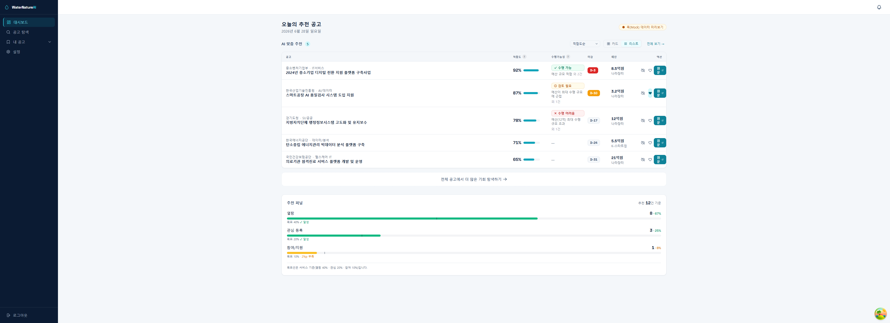
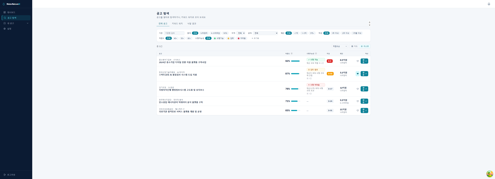
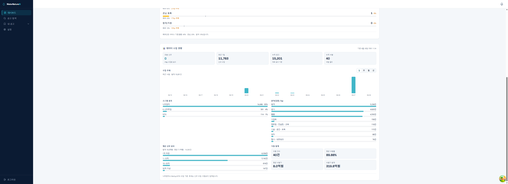

# WaterNature AI 🛰️ — 공공사업 추천 에이전트

> **우리 회사가 "딸 수 있는" 공공사업만, 매일 AI가 골라 드립니다.**
> 입찰·정부지원사업·R&D 과제를 자동으로 모아, 회사 역량에 맞는 공고만 적합도순으로 추천해요.

이 안내서는 **개발을 몰라도** 위에서부터 순서대로 따라 하면 내 컴퓨터에서 직접 실행해 볼 수 있게 썼습니다.
처음 설치까지 보통 **15~20분**(인터넷 속도에 따라 다름) 걸립니다. 명령어는 **그대로 복사해서 붙여넣기**만 하면 됩니다.

---

## 🧭 이게 무엇인가요? (1분)

- **회사 정보를 입력하면**(업종·기술·실적·인증 등) AI가 회사를 이해하고,
- **여러 공공 사이트의 공고**(나라장터·K-Startup·NTIS 등)를 매일 자동으로 모아,
- **우리 회사에 잘 맞는 공고만** 적합도 점수·근거와 함께 보여주고, **마감 임박·카카오 알림**까지 보내줍니다.

이 프로그램은 서로 돕는 **3덩어리**로 되어 있어요. (그래서 아래에서 창을 3개 켭니다)

| 덩어리 | 쉽게 말하면 | 사용 포트 |
|---|---|---|
| 🟨 **웹 화면**(프론트엔드) | 사람이 보고 클릭하는 화면 | 3000 |
| 🟩 **서버**(백엔드) | 화면 뒤에서 계산·저장하는 일꾼 | 8000 |
| 🟦 **저장소**(데이터베이스·캐시) | 데이터를 담아두는 창고 | 5433 · 6379 |

---

## 👀 화면 미리보기

**① 대시보드 — 오늘의 AI 추천 공고** _(샘플 데이터)_



**② 공고 탐색 — 출처·지역·분야·예산·마감·적합도로 필터** _(샘플 데이터)_



**③ 데이터 수집 현황 — 매일 모은 공고를 일·주·월·년 통계로** _(실제 집계 · 개별 업체/공고명 없음)_



---

## ⚡ 빠른 시작 (5분 · 터미널에 익숙한 분용)

<details>
<summary><b>펼쳐서 명령어만 한 번에 보기</b> — 처음이라면 접어두고 아래 1·2번을 천천히 따라오세요.</summary>

<br>

준비물: **Docker Desktop · Python 3.11+ · Node 20+** (자세한 설치는 [1. 준비물](#-1-준비물-설치-딱-한-번))

```bash
# 0) 코드 내려받기
git clone https://github.com/showjihyun/WaterNatureAI.git
cd WaterNatureAI

# 🟦 저장소(DB·Redis) — Docker Desktop 실행 후
cd backend
docker compose -f docker-compose.dev.yml up -d

# 🟩 서버 — 새 터미널에서
cd backend
python -m venv .venv
.venv\Scripts\Activate.ps1        # Mac/Linux: source .venv/bin/activate
pip install -e .
copy .env.example .env            # Mac/Linux: cp .env.example .env
alembic upgrade head
uvicorn app.main:app --reload --port 8000   # 첫 실행은 AI 모델(~1GB) 다운로드로 1~3분 멈춘 듯 보임(정상)

# 🟨 웹 화면 — 또 새 터미널에서
cd frontend
npm install
npm run dev
```

→ 브라우저에서 **http://localhost:3000** 접속 → 로그인 화면의 **"목 데이터 대시보드 바로가기"** 로 바로 둘러보기.
로그인이 안 되면 → [문제 해결](#-안-될-때-문제-해결) 첫 줄(포트/CORS)을 확인하세요.

</details>

---

## 🧰 1. 준비물 설치 (딱 한 번)

아래 3개를 먼저 설치하세요. 이미 있으면 건너뛰면 됩니다.

| 프로그램 | 왜 필요한가요 | 다운로드 |
|---|---|---|
| **Docker Desktop** | 저장소(데이터베이스)를 손쉽게 켜기 위해 | https://www.docker.com/products/docker-desktop/ |
| **Python 3.11+** | 서버를 실행하기 위해 | https://www.python.org/downloads/ |
| **Node.js 20+** | 웹 화면을 실행하기 위해 | https://nodejs.org/ |

> 🪟 **Python 설치 시 주의(Windows)**: 설치 첫 화면에서 **"Add python.exe to PATH"** 체크박스를 꼭 켜고 설치하세요.

### 터미널(명령어 입력 창) 여는 법

- **Windows**: 시작 메뉴에서 **`PowerShell`** 검색 → 클릭해서 실행.
- **Mac**: `⌘ + Space` → **`터미널`**(Terminal) 입력 → 실행.

설치가 됐는지 확인하려면 터미널에 아래를 한 줄씩 입력해 보세요. **버전 숫자**가 나오면 성공입니다.

```bash
docker --version
python --version
node --version
```

---

## 🚀 2. 실행하기 (터미널 3개)

> 💡 창을 **3개** 열어 둡니다 — 🟦 저장소 / 🟩 서버 / 🟨 화면.
> 한 번 켠 창은 **닫지 말고 그대로** 두세요(끄면 그 부분이 멈춥니다).

### 0) 코드 내려받기 (아무 창에서나 한 번)

```bash
git clone https://github.com/showjihyun/WaterNatureAI.git
cd WaterNatureAI
```

### 🟦 터미널 A — 저장소 켜기 (Docker)

먼저 **Docker Desktop 앱을 실행**해 두고(고래 아이콘이 초록색이 될 때까지 기다림), 터미널에:

```bash
cd backend
docker compose -f docker-compose.dev.yml up -d
```

> ✅ 이렇게 보이면 성공: `docker ps` 를 치면 **postgres**, **redis** 두 줄이 보입니다.
> (데이터베이스 PostgreSQL과 캐시 Redis가 배경에서 조용히 떠 있는 상태예요.)

### 🟩 터미널 B — 서버 켜기 (백엔드)

**새 터미널**을 열고:

```bash
cd WaterNatureAI/backend

# (1) 가상환경 만들기 — 처음 한 번만 (이 폴더 전용 파이썬 공간)
python -m venv .venv

# (2) 가상환경 켜기   ▸ Windows(PowerShell)
.venv\Scripts\Activate.ps1
#                    ▸ Mac / Linux 는 아래 한 줄
# source .venv/bin/activate

# (3) 라이브러리 설치 — 처음 한 번만 (몇 분 걸려요)
pip install -e .

# (4) 설정 파일 만들기 — 처음 한 번만   ▸ Windows
copy .env.example .env
#                                      ▸ Mac / Linux 는: cp .env.example .env

# (5) 데이터베이스 표 만들기 — 처음 한 번만
alembic upgrade head

# (6) 서버 켜기 (이 창은 계속 켜둡니다)
uvicorn app.main:app --reload --port 8000
```

> ⏳ **처음 켤 때 1~3분간 멈춘 것처럼 보여요 — 정상입니다!**
> 서버가 처음 시작할 때 AI 분석용 모델(약 1GB)을 **자동으로 내려받기** 때문이에요.
> **`Application startup complete.`** 와 **`Uvicorn running on http://127.0.0.1:8000`** 두 줄이 보이면 준비 끝.
>
> ✅ 확인: 브라우저로 **http://localhost:8000/health** 에 들어가 `{"status":"ok",...}` 가 나오면 서버 정상.
> (두 번째 실행부터는 모델을 다시 안 받아서 30초~1분이면 떠요.)

### 🟨 터미널 C — 웹 화면 켜기 (프론트엔드)

또 **새 터미널**을 열고:

```bash
cd WaterNatureAI/frontend
npm install        # 처음 한 번만 (몇 분 걸려요)
npm run dev        # 화면 켜기 (이 창도 계속 켜둡니다)
```

> ✅ `▲ Next.js ...  - Local: http://localhost:3000` 같은 줄이 보이면 성공.
> ⚠️ 만약 **3000이 아니라 3001**(또는 다른 번호)로 떴다면, 로그인이 막힐 수 있어요 → 아래 [문제 해결](#-안-될-때-문제-해결) 첫 줄을 보세요.

---

## 🖥️ 3. 열어서 써보기

브라우저에서 **http://localhost:3000** 으로 접속하세요. 🎉

### 가장 빠른 길 — 그냥 둘러보기
로그인 화면 아래 **"목(Mock) 데이터 대시보드 바로가기"** 를 누르면, 가짜 예시 데이터로 화면을 **바로** 구경할 수 있어요. (설치가 잘 됐는지 확인용)

### 제대로 써보기 — 내 회사로
1. **회원가입** → 이메일·비밀번호·회사명 입력.
2. **온보딩(회사 프로필 입력)**: 업종·기술·서비스·고객·보유 인증 등을 적고, 있으면 **회사소개서 PDF**를 올리면 AI가 더 정확히 이해해요.
3. 잠깐 **"분석 중"** 표시가 끝나면, **대시보드**에 추천이 뜹니다.

### 화면 한눈에 보기

| 화면 | 여기서 무엇을 하나요 |
|---|---|
| **대시보드** | 오늘의 **추천 공고**(적합도 점수·추천 근거·수행 가능성 신호), **마감 임박** 알림, 그리고 **데이터 수집 현황**(오늘/누적/낙찰 건수 + 일·주·월·년 추세 + 소스·분야·예산·낙찰 통계) |
| **공고 탐색** | 전체 공고를 **출처·지역·분야·예산·마감·적합도**로 필터링·정렬. **키워드 워치**(관심 키워드 저장)와 **낙찰 결과**(누가 얼마에 따냈는지) 탭 |
| **내 공고** | **관심**으로 저장한 공고, **진행 관리**(검토중→준비중→제출→완료 단계로 추적) |
| **설정** | 알림 받을 시간·조건, 우리 회사 **수행 역량**, 구독/결제, (운영자) AI 공급자·카카오 발신 설정 |
| **🔔 알림 벨** (우측 상단) | 마감 임박 공고 / 새로 들어온 키워드 매칭 공고를 모아 보여줘요 |

> 처음에는 추천이 **0건**일 수 있어요 — 아직 모은 공고가 없어서예요. 아래 **4번**에서 실제 데이터를 켜면 채워집니다.

---

## ⚙️ 4. (선택) 실제 데이터·AI·자동 수집 켜기

키 없이도 화면은 돌아가지만, **실제 공고 수집·AI 근거·카카오 알림**을 쓰려면 키가 필요해요.
키는 모두 **`backend/.env` 파일에만** 넣습니다. (이 파일은 절대 공개되지 않아요 — [보안](#-보안-중요) 참고)

| 켜고 싶은 기능 | `backend/.env` 에 넣을 항목 | 어디서 받나요 |
|---|---|---|
| **공고 수집**(나라장터·K-Startup·NTIS) | `NARAJANGTER_SERVICE_KEY` · `KSTARTUP_SERVICE_KEY` · `NTIS_SERVICE_KEY` | [공공데이터포털(data.go.kr)](https://www.data.go.kr) — 무료 |
| **AI 추천 근거**(설명 자동 생성) | `ANTHROPIC_API_KEY` 또는 `OPENAI_API_KEY` / `GEMINI_API_KEY` | 각 AI 제공사 (또는 화면 **설정 → AI 공급자**에서 입력) |
| **카카오 알림톡** | 화면 **설정 → 카카오 발신 설정** | [SOLAPI](https://solapi.com) + 사업자등록 |
| **결제(Toss)** | `TOSS_CLIENT_KEY` · `TOSS_SECRET_KEY` | [토스페이먼츠](https://www.tosspayments.com) |

> 📌 `.env` 를 고친 뒤에는 **🟩 서버를 다시 켜야** 적용돼요: 서버 창에서 `Ctrl + C` → 위 **(6) 서버 켜기** 명령 다시 실행.

### 매일 자동으로 모으기 (작업 일꾼 켜기)

공고를 **매일 자동**으로 수집·매칭·알림하려면, **새 터미널**(가상환경 켠 상태)에서 일꾼(worker)을 켜세요:

```bash
cd backend
# Windows
python -m celery -A app.core.celery_app.celery_app worker -B --pool=solo --loglevel=info
# Mac / Linux
# celery -A app.core.celery_app.celery_app worker -B --loglevel=info
```

> 한국시간 매일 오전에 **수집 → 매칭 → 브리핑**이 자동으로 돕니다. 이 일꾼 창도 켜둔 채로 두세요.

---

## ❓ 안 될 때 (문제 해결)

| 증상 | 이렇게 해보세요 |
|---|---|
| **로그인·회원가입이 안 돼요** (가장 흔함) | 🟨 화면이 **3000이 아닌 다른 번호**(예: 3001)로 떴을 가능성이 커요. `backend/.env` 의 `CORS_ORIGINS` 줄에 그 주소(예: `http://localhost:3001`)를 콤마로 추가 → **🟩 서버 재시작**. |
| **서버가 한참 멈춰 있어요 (처음 실행)** | 정상이에요. AI 모델(약 1GB)을 내려받는 중입니다. `Application startup complete.` 가 뜰 때까지 1~3분 기다리세요. |
| **`알 수 없는 명령` / `command not found` (uvicorn·alembic·celery)** | 🟩 가상환경이 안 켜졌어요. 프롬프트 앞에 `(.venv)` 가 보이는지 확인 → 안 보이면 **B-(2)** 다시 실행. |
| **DB 연결 실패 / 500 에러** | 🟦 Docker Desktop이 켜져 있고 `docker ps` 에 postgres·redis 가 떠 있는지 확인. 없으면 **A** 단계 다시. |
| **포트가 이미 사용 중(5433/6379/8000)** | 다른 프로그램이 그 번호를 쓰는 중이에요. 그 프로그램을 끄거나, `backend/.env`·`docker-compose.dev.yml`에서 번호를 바꾼 뒤 재시작. |
| **추천 공고가 0건** | 아직 모은 공고가 없어서예요. **목 데이터**로 먼저 둘러보거나, 위 **4번**으로 공공데이터 키를 넣고 자동 수집을 켜세요. |
| **코드를 고쳤는데 안 바뀜** | 🟩 서버는 `--reload`로 자동 반영돼요. 안 되면 서버 창 `Ctrl + C` 후 다시 켜기. |

---

## 📁 폴더 구조 (간단히)

```
WaterNatureAI/
├─ backend/        🟩 서버 (Python · FastAPI)
│  ├─ app/         실제 코드 (api · services · db · core)
│  ├─ alembic/     데이터베이스 표 정의(마이그레이션)
│  ├─ .env         ← 내 키/설정 (직접 만듦 · 공개 안 됨)
│  ├─ .env.example   ← 설정 견본 (이걸 복사해 .env 를 만듦)
│  └─ docker-compose.dev.yml   🟦 저장소(DB·Redis) 실행 설정
├─ frontend/       🟨 웹 화면 (TypeScript · Next.js)
│  └─ src/         페이지 · 화면 부품(컴포넌트)
└─ docs/           기술 설계 문서 (개발자용)
```

---

## 🔒 보안 (중요)

- **비밀 키는 절대 코드나 깃(GitHub)에 올리지 마세요.** 모든 키는 `backend/.env` · `frontend/.env.local` 에만 넣습니다. 이 파일들은 `.gitignore`로 공개에서 제외돼 있고, 실수로 올리지 않도록 **커밋 전 안전장치(pre-commit)** 도 들어 있어요.
- 비밀번호는 **Argon2**로 안전하게 저장되고, 로그인 토큰은 **httpOnly 쿠키**로 보호됩니다.
- 실제 운영 배포 시에는 `.env` 의 `APP_ENV` 를 `local` 이 아닌 값으로 바꾸고, `JWT_SECRET`·`APP_SECRET_KEY` 를 **강한 랜덤값(32자 이상)** 으로 설정하세요. (안 하면 서버가 안전을 위해 **부팅을 거부**합니다.)

---

## 🧑‍💻 개발자용 (참고)

```bash
cd backend
pytest tests/unit -q      # 단위 테스트 (DB 불필요)
ruff check app/           # 코드 스타일 검사

cd ../frontend
npm run typecheck         # 타입 검사
```

자세한 설계·아키텍처는 [`docs/`](docs/) 폴더를 참고하세요.

---

## 📜 라이선스

루트의 [`LICENSE`](LICENSE) 파일을 참고하세요.
