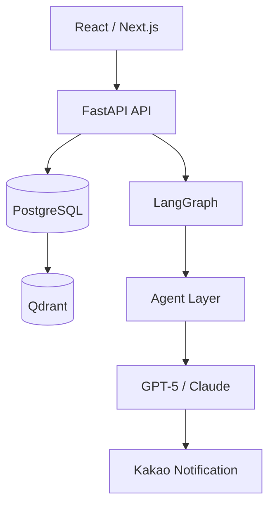

# ARCHITECTURE — BizRadar AI

> **System Architecture**
> **Version:** 1.0
> **원본:** `docs/init-biz-build-up/BizRadar AI Architecture.pdf`

---

## 1. Architecture Overview



원본 텍스트 다이어그램:

```
┌─────────────────────────────┐
│       React / Next.js       │
└─────────────┬───────────────┘
              ▼
┌─────────────────────────────┐
│         FastAPI API         │
└───────┬───────────┬─────────┘
        ▼           ▼
   PostgreSQL    LangGraph
        ▼           ▼
     Qdrant     Agent Layer
                    ▼
              GPT-5 / Claude
                    ▼
            Kakao Notification
```

---

## 2. Frontend Architecture

**Stack:** React, Next.js, TypeScript, TailwindCSS, React Query

**Pages**

| 영역 | 화면 |
|---|---|
| Auth | Login, Register |
| Dashboard | Today Recommendations, Statistics |
| Company | Company Profile, Document Upload |
| Opportunity | List, Detail |
| Settings | Notification, Billing |

---

## 3. Backend Architecture

**Stack:** FastAPI, SQLAlchemy, Alembic, Celery, Redis

**Services**

| 서비스 | 책임 |
|---|---|
| Auth Service | 로그인, 회원가입, JWT |
| Company Service | 회사 정보 관리, Context 생성 |
| Opportunity Service | 공고 수집, 공고 저장 |
| Matching Service | 적합도 계산, 추천 생성 |
| Notification Service | 카카오 알림 발송 |

---

## 4. Agent Architecture

| Agent | 입력 | 출력 |
|---|---|---|
| Company Brain Agent | 기업 정보, 소개서 | Company Context |
| Opportunity Collector Agent | Source Config | Opportunity |
| Matching Agent | Company Context, Opportunity | Score, Recommendation |

---

## 5. Database Architecture

**users**

```
id UUID PK, email, password_hash, company_id FK, created_at
```

**companies**

```
id UUID PK, name, industry, description, region, phone, created_at
```

**notification_settings**

```
company_id PK/FK, enabled, channel, send_hour(KST), send_empty, updated_at
```

> 관계: **users N:1 companies**(users.company_id). 알림·매칭 단위 = company. 전화번호·수신설정 = company 단위. 마이그레이션 [db-schema §11](db-schema-opportunities.md).

**company_contexts**

```
id UUID PK, company_id FK, context_json JSONB,
content_hash, embedded_hash, embedded_at, embedding_version
```

> ℹ️ **F5 해소:** Qdrant point id = `company_contexts.id` **재사용**(별도 `embedding_id` 폐기). 재임베딩 추적 컬럼은 `opportunities`와 대칭. 마이그레이션은 [db-schema §10](db-schema-opportunities.md).

**opportunities**

```
id UUID PK, title, agency, budget, deadline, description, source
```

> ℹ️ P0 4종 통합을 위한 **확장 정식 스키마**(source_uid/content_hash/증분·변경이력·임베딩 추적 + DDL/Alembic): [db-schema-opportunities.md](db-schema-opportunities.md)

**matches**

```
id UUID PK, company_id, opportunity_id, score, reason,
subscore JSONB, risk, created_at
+ FK(opportunity_id), UNIQUE(company_id, opportunity_id)
```

**user_opportunity_actions**

```
id UUID PK, company_id, opportunity_id, action_type, created_at
```

---

## 6. Vector Architecture

**pgvector (Postgres 내장 — Qdrant 대체, 2026-06-19)**

벡터를 별도 DB 대신 **각 행의 `embedding vector(1024)` 컬럼**에 저장 → 인프라 1개 감소, RDB와 한 트랜잭션.

| 테이블 | 벡터 컬럼 | 저장 |
|---|---|---|
| company_contexts | `embedding vector(1024)` | 기업 임베딩 |
| opportunities | `embedding vector(1024)` | 사업공고 임베딩 |

> 임베딩이 행 컬럼이라 PK가 곧 식별자(별도 point id 불필요). 코사인 검색 `embedding <=> :vec`(`vector_cosine_ops`). 코드 `embedding/vectorstore.py`. 모델·버전·재임베딩은 [embed-worker.md](embed-worker.md).

---

## 7. LLM Architecture

> 🔄 **개정(2026-06-20): LLM은 optional·기본 OFF.** 사용자 결정 — MVP는 LLM 없이 **규칙/임베딩 기반**으로 동작(키 불필요). `anthropic`은 optional extra(`[llm]`). 매칭 근거는 규칙 템플릿, Company Context는 구조화 프로필 fallback. `pip install .[llm]` + `ANTHROPIC_API_KEY` 설정 시 AI 근거·문서 이해가 자동 활성(코드 보존). 아래 "Primary GPT-5/Fallback Claude"는 **활성화 시의 옵션** 설계로 읽을 것.

**Model**

- **Primary:** GPT-5
- **Fallback:** Claude

**Usage**

| 용도 | 설명 |
|---|---|
| Company Brain | 회사 이해 |
| Matching | 추천 근거 생성 |
| Daily Briefing | 요약 생성 |

> ⚠️ 모델 선정은 검토 필요 항목이다. 상세는 `docs/00-overview/service-analysis.md`의 리뷰 포인트 참조.

---

## 8. Scheduler Architecture

| 시각(KST) | 작업 |
|---|---|
| Daily 08:50 | Status Sweep (마감 경과 open→closed) |
| Daily 09:00 | Opportunity Collection 입찰공고 (+ 정규화·UPSERT·재임베딩) |
| Daily 09:05 | 낙찰 수집 → `opportunity_awards` (추천 파이프라인 밖) |
| Daily 09:30 | Dedup 배치 (중복 군집·대표 선정) |
| Daily 10:00 | Matching (`is_canonical` + `status=open` 대상) |
| Daily 11:00 | Kakao Notification (Top 3) |

> 표준 타임라인 정본: [정합성 리뷰 §3](../00-overview/design-consistency-review.md). 소스별 수집·증분·dedup·인증키는 [데이터 소스 설계](data-ingestion.md) 참조.

---

## 9. Deployment Architecture (MVP)

| 영역 | 선택 |
|---|---|
| Frontend | Vercel |
| Backend | Railway 또는 Render |
| Database | PostgreSQL |
| Vector | pgvector (Postgres 내장 — 별도 Vector DB 없음) |
| Monitoring | OpenTelemetry, Langfuse, Sentry |

---

## 10. Future Architecture

| 버전 | 내용 |
|---|---|
| v2 | Go / No-Go Agent |
| v3 | Winning Strategy Agent |
| v4 | Proposal Copilot |
| v5 | AI Business Development Team |
