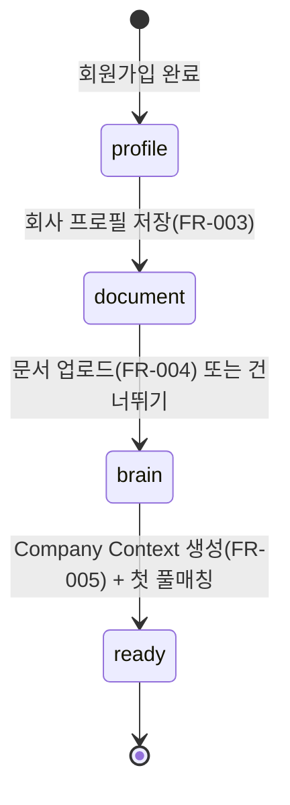

# 인증 / 온보딩 설계

> 회원가입·로그인·JWT 인증과, 가입 후 Company Context 생성까지의 온보딩 플로우. FR-001·002 + FR-003~005 연결.
> 관련: [FSD FR-001~005](../03-spec/fsd.md) · [Company Brain](company-brain.md) · [통합 스키마 §11](db-schema-opportunities.md) · [Architecture §3 Auth](architecture.md)
> 스택: FastAPI · SQLAlchemy · JWT · Argon2 · **작성 기준일:** 2026-06-18

---

## 1. 범위 & 위치

- 인증: 회원가입(FR-001), 로그인(FR-002), 토큰 갱신/로그아웃.
- 온보딩: 회사 프로필(FR-003) → 문서 업로드(FR-004) → Company Brain(FR-005) → 첫 매칭 → 사용 준비.
- 계정 모델: **users N:1 companies**(리뷰 G2 확정). 가입 시 **회사 + 관리자 user 동시 생성**, 추가 멤버 초대는 MVP 이후.

---

## 2. 데이터 모델 (마이그레이션 `0007_auth`)

`users.company_id`·`companies`는 [db-schema §11 `0006`](db-schema-opportunities.md)에서 생성됨. 본 마이그레이션은 인증 보강.

```sql
-- 역할·이메일 인증
ALTER TABLE users
    ADD COLUMN role TEXT NOT NULL DEFAULT 'company_admin',  -- company_admin (MVP)
    ADD COLUMN email_verified_at TIMESTAMPTZ;

-- 온보딩 진행 상태 (company 단위)
ALTER TABLE companies
    ADD COLUMN onboarding_status TEXT NOT NULL DEFAULT 'profile';
    -- profile → document → brain → ready

-- refresh 토큰(회전·폐기용)
CREATE TABLE refresh_tokens (
    id          UUID PRIMARY KEY DEFAULT gen_random_uuid(),
    user_id     UUID NOT NULL REFERENCES users(id) ON DELETE CASCADE,
    token_hash  TEXT NOT NULL,            -- 원문 미저장(해시)
    expires_at  TIMESTAMPTZ NOT NULL,
    revoked_at  TIMESTAMPTZ,
    created_at  TIMESTAMPTZ NOT NULL DEFAULT now()
);
CREATE INDEX idx_refresh_user ON refresh_tokens (user_id) WHERE revoked_at IS NULL;
```

---

## 3. 회원가입 (FR-001)

- **입력:** email, password, company_name. **출력:** user_id, access token(+refresh).
- **검증:** 이메일 형식·중복 불가, 비밀번호 ≥8자(+복잡도 권장).
- **비밀번호 해시:** **Argon2id**(권장) 또는 bcrypt. 평문 미저장.
- **트랜잭션:** `companies` 생성 → `users`(company_id, role=company_admin) 생성 → 토큰 발급. 실패 시 전체 롤백.
- (선택) 이메일 인증: MVP는 가입 즉시 사용 허용 + 사후 인증 배지. 운영 시 활성화.

---

## 4. 로그인 (FR-002) & JWT

- **입력:** email, password → 해시 검증 → access + refresh 발급.
- **Access token:** 짧게(예 30분), 클레임 `{ sub: user_id, company_id, role }`. 서명 RS256/HS256.
- **Refresh token:** 길게(예 14일), **회전(rotation)** + `refresh_tokens` 해시 저장으로 폐기/탈취 대응. 갱신 시 기존 토큰 revoke, 신규 발급.
- **로그아웃:** 해당 refresh 토큰 revoke(서버), 클라이언트 토큰 폐기.
- **company_id를 토큰에 포함** → 모든 데이터 접근을 company 범위로 필터(테넌트 격리).

---

## 5. 인가 (Authorization)

- 역할: `company_admin`(MVP 단일). 추후 `member`(읽기 전용 등) 확장 여지.
- **company 스코프 강제:** 매칭·공고·알림·결제 등 모든 조회/변경은 토큰의 `company_id`로 제한(다른 회사 데이터 접근 차단).
- 보호 엔드포인트는 access token 검증 미들웨어 통과 필수.

---

## 6. 온보딩 플로우 (상태 머신)



- `companies.onboarding_status`로 단계 추적. 프론트는 상태에 맞는 화면으로 라우팅.
- **brain → ready:** [Company Brain](company-brain.md) `build_company_context` 완료 → 전체 열린 공고 1회 풀매칭([matching §6](matching-engine.md)) → `ready`.
- 문서 업로드는 선택(건너뛰면 프로필만으로 Context 생성, 품질 낮음 표시).
- `ready` 이후 결제 유도([billing](billing.md)) — 구독 활성 시 Daily Briefing 발송 대상.

---

## 7. 보안 (FSD 비기능 정합)

- 전 구간 **HTTPS**, 비밀번호 **해시 저장**, **JWT** 인증(FSD 보안).
- 로그인 **rate limit**·실패 카운트(브루트포스 방지), refresh **회전+폐기**.
- 비밀번호 재설정(이메일 토큰), (선택) 이메일 인증.
- 토큰 시크릿·해시 파라미터는 Secret Manager.

---

## 8. 엔드포인트 (REST)

| 메서드 | 경로 | 설명 | 인증 |
|---|---|---|---|
| POST | `/auth/register` | 회사+관리자 생성, 토큰 발급 | 공개 |
| POST | `/auth/login` | 로그인, 토큰 발급 | 공개 |
| POST | `/auth/refresh` | refresh 회전·access 재발급 | refresh |
| POST | `/auth/logout` | refresh 폐기 | access |
| POST | `/auth/password/reset` | 비밀번호 재설정 요청/확정 | 공개/토큰 |
| GET | `/me` | 내 정보·회사·온보딩 상태 | access |
| PUT | `/company/profile` | 프로필 저장(FR-003) → status=document | access |
| POST | `/company/documents` | 문서 업로드(FR-004) | access |
| POST | `/company/brain` | Context 생성 트리거(FR-005) | access |

---

## 9. 의사코드

```python
@router.post("/auth/register")
def register(body):
    if user_repo.email_exists(body.email):
        raise Conflict("email")
    validate_password(body.password)              # ≥8자 등
    with tx():
        company = company_repo.create(name=body.company_name, onboarding_status="profile")
        user = user_repo.create(email=body.email, company_id=company.id,
                                password_hash=argon2.hash(body.password),
                                role="company_admin")
    return issue_tokens(user)                      # access + refresh(저장)

@router.post("/auth/login")
def login(body):
    user = user_repo.by_email(body.email)
    if not user or not argon2.verify(user.password_hash, body.password):
        raise Unauthorized()
    return issue_tokens(user)

@router.post("/auth/refresh")
def refresh(token):
    rec = refresh_repo.active_by_hash(sha256(token))
    if not rec or rec.expires_at < now():
        raise Unauthorized()
    refresh_repo.revoke(rec.id)                    # 회전
    return issue_tokens(user_repo.get(rec.user_id))
```

---

## 10. 엣지 케이스

| 케이스 | 처리 |
|---|---|
| 이메일 중복 | 409 Conflict |
| 약한 비밀번호 | 검증 실패 422 |
| refresh 재사용(탈취) | 회전으로 무효화, 해당 사용자 토큰 일괄 폐기 옵션 |
| 온보딩 미완료 사용자 | 보호 리소스 접근 시 온보딩으로 유도 |
| company 없는 user(데이터 이상) | 가입 트랜잭션으로 방지(항상 company_id 존재) |
| 결제 미구독 | 기능 일부 제한·Briefing 미발송([billing](billing.md)) |

---

## 11. 설정 (env)

```
JWT_ALG=HS256
JWT_ACCESS_TTL_MIN=30
JWT_REFRESH_TTL_DAYS=14
JWT_SECRET=...                  # Secret Manager
PASSWORD_HASH=argon2id
LOGIN_RATE_LIMIT=10/min
```

---

## 12. 검증 & 다음 단계
- [ ] 가입 트랜잭션(company+user) 원자성 테스트
- [ ] JWT 발급/검증·refresh 회전·로그아웃 폐기 테스트
- [ ] company 스코프 격리(타 회사 데이터 차단) 테스트
- [ ] 온보딩 상태 전이 + 프론트 라우팅 연동
- [ ] 비밀번호 재설정·(선택)이메일 인증
- [ ] 결제 연동([billing.md](billing.md))과 구독 게이트 연결
