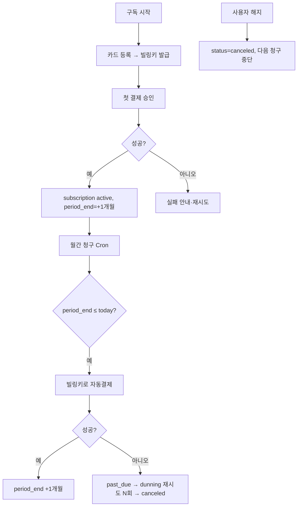

# 결제(Toss) 기본 틀 설계

> Toss Payments 정기결제 기반 구독(월정액 단일 플랜)의 **스캐폴딩**. 데이터 모델·흐름·추상화만 정의하고, **라이브 결제는 사업자등록·Toss 가맹 심사 후** 활성화한다.
> 관련: [인증/온보딩](auth-onboarding.md) · [Daily Briefing](daily-briefing.md)
> **작성 기준일:** 2026-06-18

---

## 0. 현재 상태 (중요)

> ✅ **test-mode 구현 완료(2026-06-20):** `TossProvider`(빌링키 발급 `/v1/billing/authorizations/issue`·정기결제 `/v1/billing/{billingKey}`·웹훅, Basic 인증, 키게이트) + `billing/service.py`(`start_subscription`·`charge_due`·`active_subscribed`) + `api/v1/billing.py`(`/billing/subscribe`·`/subscription`·`/webhook`). 외부 HTTP 모킹 테스트(integration 33). **실키·정산은 사업자등록+Toss 가맹 심사 후.**
> 🚧 **라이브 결제는 사업자등록 전이라 불가** — 아래는 설계/활성화 절차.
> - **블로커:** 사업자등록번호 없음 → Toss 가맹점 계약/심사·실 정산 불가.
> - **지금 가능:** Toss **테스트 키(sandbox)** 로 빌링키 발급·결제 승인 **연동 골격**만 검증.
> - **추상화 우선:** `PaymentProvider` 인터페이스로 결제 로직을 격리 → 사업자 확보 후 실키만 주입하면 동작하도록 설계.

---

## 1. 플랜

| 플랜 | 코드 | 주기 | 비고 |
|---|---|---|---|
| Basic | `basic_monthly` | 월 | MVP 단일 월정액 플랜(금액은 `plans` 시드 참조) |
| (로드맵) Pro / Enterprise | — | 월 | v2·v3, `plans` 테이블로 확장 |

---

## 2. 데이터 모델 (마이그레이션 `0008_billing`)

```sql
CREATE TABLE plans (
    code      TEXT PRIMARY KEY,           -- 'basic_monthly'
    name      TEXT NOT NULL,
    amount    INTEGER NOT NULL,           -- KRW (금액은 plans 시드 참조)
    interval  TEXT NOT NULL DEFAULT 'month',
    enabled   BOOLEAN NOT NULL DEFAULT TRUE
);
INSERT INTO plans (code, name, amount) VALUES ('basic_monthly', 'Basic', :amount);

CREATE TABLE billing_keys (
    id           UUID PRIMARY KEY DEFAULT gen_random_uuid(),
    company_id   UUID NOT NULL REFERENCES companies(id) ON DELETE CASCADE,
    provider     TEXT NOT NULL DEFAULT 'toss',
    billing_key  TEXT NOT NULL,           -- 암호화 저장(카드정보 아님)
    customer_key TEXT NOT NULL,           -- 우리측 고객 식별자
    card_company TEXT, card_last4 TEXT,
    status       TEXT NOT NULL DEFAULT 'active',  -- active|deleted
    issued_at    TIMESTAMPTZ NOT NULL DEFAULT now()
);

CREATE TABLE subscriptions (
    id            UUID PRIMARY KEY DEFAULT gen_random_uuid(),
    company_id    UUID NOT NULL REFERENCES companies(id) ON DELETE CASCADE,
    plan_code     TEXT NOT NULL REFERENCES plans(code),
    status        TEXT NOT NULL DEFAULT 'trialing',  -- trialing|active|past_due|canceled
    billing_key_id UUID REFERENCES billing_keys(id),
    current_period_start TIMESTAMPTZ,
    current_period_end   TIMESTAMPTZ,
    canceled_at   TIMESTAMPTZ,
    created_at    TIMESTAMPTZ NOT NULL DEFAULT now(),
    updated_at    TIMESTAMPTZ NOT NULL DEFAULT now(),
    CONSTRAINT uq_sub_company UNIQUE (company_id)     -- 회사당 1 구독
);

CREATE TABLE payments (
    id           UUID PRIMARY KEY DEFAULT gen_random_uuid(),
    company_id   UUID NOT NULL REFERENCES companies(id),
    subscription_id UUID REFERENCES subscriptions(id),
    order_id     TEXT NOT NULL UNIQUE,    -- 멱등 키(우리 생성)
    amount       INTEGER NOT NULL,
    currency     TEXT NOT NULL DEFAULT 'KRW',
    status       TEXT NOT NULL,           -- ready|done|failed|canceled
    provider     TEXT NOT NULL DEFAULT 'toss',
    provider_payment_key TEXT,            -- Toss paymentKey
    failure_reason TEXT,
    paid_at      TIMESTAMPTZ,
    created_at   TIMESTAMPTZ NOT NULL DEFAULT now()
);
```

---

## 3. Toss 정기결제 메커니즘

1. **빌링키 발급:** 클라이언트가 `customerKey`로 카드 등록(Toss SDK/결제창 인증) → 서버가 빌링키 발급 API 호출 → `billing_keys` 저장(빌링키만, 카드원본 미보관).
2. **정기 결제:** 서버가 빌링키로 승인 요청(`amount`, `orderId`, `customerKey`, `orderName`) → 결과를 `payments` 기록.
3. **웹훅:** Toss 결제 상태 변경 이벤트 수신 → `payments`/`subscriptions` 갱신.

> 엔드포인트·필드(빌링키 발급/승인 경로, `Authorization: Basic {secretKey}`)는 **Toss 공식 문서로 확정**(버전 변동 가능). 인증키는 테스트/라이브 분리.

---

## 4. 결제 흐름



- **dunning:** 결제 실패 시 `past_due` + 재시도 스케줄(예 1·3·5일), 한도 초과 시 `canceled`.
- **해지:** 즉시 `canceled` 또는 기간 만료 시 해지(정책 결정 — 기본: 기간 만료까지 유지).

---

## 5. PaymentProvider 추상화

```python
class PaymentProvider(ABC):
    def issue_billing_key(self, customer_key, auth_key) -> BillingKey: ...
    def charge(self, billing_key, amount, order_id, order_name) -> Payment: ...
    def handle_webhook(self, payload) -> Event: ...

class TossProvider(PaymentProvider):   # 테스트키로 골격 검증, 실키는 사업자 확보 후
    ...
```
- 결제 로직을 인터페이스 뒤로 격리 → 실키 주입만으로 라이브 전환. 테스트 모드 플래그 분리.

---

## 6. G6 해소 — 구독 게이트

- `active_subscribed(company_id)` = `subscriptions.status IN ('active','trialing')`.
- [Daily Briefing](daily-briefing.md) 발송 대상 = `notification_settings.enabled` **AND** `active_subscribed`.
- **무료 체험(`trialing`) = 14일 확정**(리뷰 H2 해소, 비드라온 벤치마킹 [competitor-bidraon-ux §4](../05-spikes/competitor-bidraon-ux.md)). 가입 즉시 trialing 14일 → 그 기간 Briefing·대시보드 노출 → 전환 유도. (가입 시 사업자번호 수집 권장 — onboarding 자동완성과 연계)

---

## 7. 보안·규정

- **카드 원본 미저장**(PCI 회피) — Toss가 보유, 우리는 빌링키만(암호화).
- 빌링키·시크릿키 Secret Manager, 테스트/라이브 키 분리.
- 웹훅 서명 검증, `order_id` 멱등(중복 결제 방지).
- 전자상거래법: 청약철회·환불·세금계산서/현금영수증·이용약관 — **사업자 확보 후 정비**.

---

## 8. 활성화 체크리스트 (라이브 전환)

- [ ] **사업자등록** 완료
- [ ] Toss Payments 가맹 계약·심사 + 정산계좌 등록
- [ ] 라이브 클라이언트/시크릿 키 발급 → Secret Manager
- [ ] 결제·환불·약관/개인정보·전자상거래 고지 페이지
- [ ] 웹훅 엔드포인트 등록·서명 검증
- [ ] 세금계산서/현금영수증 처리

---

## 9. 설정 (env)

```
PAYMENT_PROVIDER=toss
TOSS_MODE=test                 # test | live
TOSS_CLIENT_KEY=...            # 테스트 키(현재) / 라이브 키(사업자 후)
TOSS_SECRET_KEY=...
BILLING_PLAN_DEFAULT=basic_monthly
DUNNING_RETRY_DAYS=1,3,5
```

---

## 10. 엣지 케이스 & 다음 단계

| 케이스 | 처리 |
|---|---|
| 사업자 미확보(현재) | 테스트 모드만, 라이브 차단 플래그 |
| 결제 실패 | past_due + dunning 재시도 → canceled |
| 빌링키 만료/삭제 | 재등록 유도, 결제 보류 |
| 중복 결제 | `order_id` 멱등·웹훅 idempotency |
| 해지 후 재구독 | 기존 subscription 재활성 또는 신규 |

- [ ] Toss 공식 문서로 빌링 API 경로·필드 확정
- [ ] 사업자 확보 후 §8 체크리스트 수행 → 라이브 전환
- [ ] 구독 상태 → 기능 게이트(Briefing/대시보드) 연결 검증
