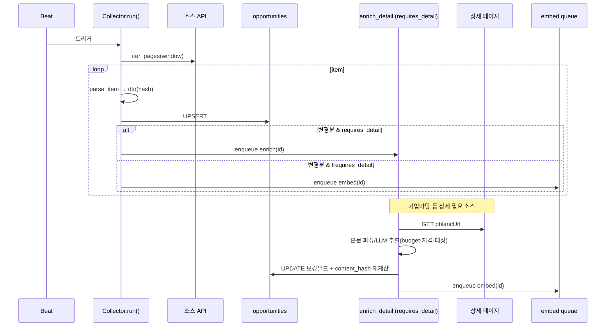

# BaseCollector 추상화 & 기업마당 Collector 설계

> 나라장터에서 검증한 `수집→정규화→UPSERT→변경감지→재임베딩` 파이프라인을 **BaseCollector**로 공통화하고, 그 위에서 **기업마당(Bizinfo) Collector**(상세 본문 추출 포함)를 구현한다.
> 관련: [나라장터 Collector](collector-narajangter.md) · [P0 API 스펙 §2](p0-source-spec.md) · [통합 스키마](db-schema-opportunities.md) · [수집·갱신 설계](data-ingestion.md)
> 스택: FastAPI · SQLAlchemy · Celery + Redis · Qdrant · **작성 기준일:** 2026-06-18

---

## 1. BaseCollector — 무엇을 공통화하나

[나라장터 설계](collector-narajangter.md)의 흐름 중 **소스 불변(invariant)** 부분을 추출한다. 소스별로 달라지는 것만 추상 메서드로 남긴다.

| 공통(템플릿) | 소스별(추상 메서드) |
|---|---|
| 증분 윈도우 계산, 상태 read/write | `source_code` |
| 페이지 순회·종료 판정 골격 | `iter_pages(window)` → raw item 스트림 |
| UPSERT, content_hash 변경감지 | `parse_item(raw)` → `OpportunityDTO` |
| `opportunity_changes` 적재 | `requires_detail`(상세 추출 필요 여부) |
| 재임베딩 enqueue 정책 | `fetch_detail(dto)`(필요 시) |
| 실패 격리·재시도·관측성 | `dedup_keys`(중복 소스 표시 정책, 선택) |

### 1.1 템플릿 메서드 `run()`

```python
class BaseCollector(ABC):
    source_code: str
    requires_detail: bool = False        # True면 list 단계에서 임베딩 보류 → 상세 후 임베딩

    @abstractmethod
    def iter_pages(self, window) -> Iterator[list[dict]]: ...
    @abstractmethod
    def parse_item(self, raw: dict) -> OpportunityDTO: ...
    def fetch_detail(self, dto: OpportunityDTO) -> OpportunityDTO:  # 선택 override
        return dto

    def run(self):
        state = state_repo.get_or_create(self.source_code)
        window = self._window(state)             # [last_success-buffer, now] / 최초 backfill
        state_repo.mark_running(self.source_code)
        total = 0
        try:
            for page_items in self.iter_pages(window):     # 소스별 순회
                for raw in page_items:
                    dto = self.parse_item(raw)             # 소스별 매핑+hash
                    result = opp_repo.upsert(dto)          # 공통 UPSERT
                    if result.changed:
                        change_repo.insert(result.id, result.old_hash,
                                           dto.content_hash, result.old_ord, dto.source_ord)
                        if self.requires_detail:
                            enrich_detail.delay(self.source_code, result.id)  # 2단계
                        else:
                            embed_opportunity.delay(result.id)
                    else:
                        opp_repo.touch_last_seen(result.id)
                    total += 1
            state_repo.mark_success(self.source_code, window.end, total)
        except TransientError:
            state_repo.mark_failed(self.source_code, traceback)   # last_success 불변 → 재시도
            raise
```

- **`iter_pages`가 윈도우 종료를 책임진다** — 소스가 서버사이드 날짜필터를 주면 그걸로, 아니면 클라이언트 cutoff로(§3.2).
- `requires_detail=True`면 list 단계에서 임베딩을 **보류**하고 상세 보강 후 임베딩(중복 임베딩 방지).
- 나라장터는 `requires_detail=False` + `iter_pages`가 4 업무유형×페이지를 순회하도록 구현(기존 설계 그대로).

---

## 2. 시퀀스 (공통 + 상세 2단계)



---

## 3. 기업마당(Bizinfo) Collector

### 3.1 나라장터와의 차이

| 항목 | 나라장터 | 기업마당 |
|---|---|---|
| 엔드포인트 | 4 업무유형 오퍼레이션 | 단일 `uss/rss/bizinfoApi.do` |
| 인증키 | data.go.kr | **기업마당 자체 `crtfcKey`** |
| 페이징 | `pageNo`/`numOfRows` | `pageIndex`/`pageUnit` |
| 증분 필터 | 서버 `inqryBgnDt~EndDt` | **서버 날짜필터 가정 불가 → 역순 cutoff** |
| 날짜 | 게시/마감 분리 | `reqstBeginEndDe` **범위 문자열 1개** → 분리 파싱 |
| 예산/자격 | 목록에 일부 포함 | **목록엔 없음 → 상세 본문 추출 필요**(`requires_detail=True`) |

### 3.2 증분 = 역순 cutoff (서버 날짜필터 없을 때)

```
pageIndex 1부터 최신순으로 받되,
  - 이미 본 pblancId(존재 & hash 동일) 연속 K건 → 종료
  - 또는 creatPnttm < (last_success_at - buffer) 도달 → 종료
  - MAX_PAGES 가드
```
- UPSERT 멱등이므로 cutoff가 약간 보수적이어도(겹쳐 받아도) 무해.
- 최초 백필은 `creatPnttm` 기준 N개월까지 페이지 진행.

### 3.3 정규화 매핑 (list 단계)

| 컬럼 | 기업마당 필드 | 처리 |
|---|---|---|
| `source` | — | `'bizinfo'` |
| `source_uid` | `pblancId` | 그대로 |
| `title` | `pblancNm` | trim |
| `agency` | `jrsdInsttNm` ?? `excInsttNm` | 소관 우선 |
| `category` | `pldirSportRealmLclasCodeNm` | 분야명 |
| `posted_at` | `creatPnttm` | KST 파싱 |
| `application_start_at` / `deadline` | `reqstBeginEndDe` | **범위 분리**(아래) |
| `detail_url` | `pblancUrl` | 상세 fetch 대상 |
| `description` | (분야+요약) | 상세 보강 전 임시 |
| `budget_*` | — | 상세 보강에서 채움 |
| `raw_json` | item | 보존 |

**`reqstBeginEndDe` 분리** — `"YYYYMMDD ~ YYYYMMDD"` / `"YYYY.MM.DD~YYYY.MM.DD"` 등 변형 → 정규식으로 시작·종료 추출, 단일/상시(예: "예산소진시") 케이스는 `deadline=NULL` + 플래그.

### 3.4 상세 본문 추출 (`enrich_detail`)

```python
@celery.task(bind=True, autoretry_for=(TransientError,), retry_backoff=True, max_retries=4)
def enrich_detail(self, source_code, opp_id):
    opp = opp_repo.get(opp_id)
    html = http.get(opp.detail_url, timeout=...)        # 정중한 요청(지연/UA)
    fields = extract_bizinfo_detail(html)               # 1차 구조 파서
    if fields.incomplete:                               # 누락 시 LLM 보강
        fields = llm_extract(html_text, schema=DETAIL_SCHEMA)  # budget/자격/대상/평가
    opp_repo.update_enriched(opp_id,
        description=fields.body, budget_raw=fields.budget_raw,
        budget_amount=parse_won(fields.budget_raw),
        region=fields.region)
    new_hash = sha256_norm(opp.title, opp.agency, opp.deadline,
                           fields.budget_amount, fields.body)
    if new_hash != opp.content_hash:
        opp_repo.set_content_hash(opp_id, new_hash)
        change_repo.insert(opp_id, opp.content_hash, new_hash)
    embed_opportunity.delay(opp_id)                     # 보강 후 임베딩
```

- **추출 전략:** 구조 파서 우선(저비용·결정적) → 실패/누락 필드만 LLM 추출(최신 Claude, [service-analysis §8](../00-overview/service-analysis.md)). 비용 통제 위해 LLM은 보강 필요분에만.
- **2단계 해시:** list 단계 hash는 본문 미포함 → 상세 후 재계산. content_hash 변경 시에만 추가 변경이력/임베딩(중복 방지).
- **DETAIL_SCHEMA:** `{ body, budget_raw, region, eligibility, eval_items }` (MVP는 body/budget 우선).

### 3.5 K-Startup과의 중복(창업 분야)
- 기업마당 창업 분야 ↔ K-Startup 공고가 겹칠 수 있음. **저장은 `(source, source_uid)`로 분리 보관**(원천 보존), **표시 단계에서 dedup**(title 유사도 + deadline 근접). 수집기는 합치지 않는다.

---

## 4. 의사코드 (BizinfoCollector)

```python
class BizinfoCollector(BaseCollector):
    source_code = "bizinfo"
    requires_detail = True

    def iter_pages(self, window):
        seen_streak = 0
        for page in count(1):
            items = client.fetch(crtfc_key=KEY, data_type="json",
                                  page_index=page, page_unit=100)
            if not items:
                return
            # cutoff: 등록일이 윈도우 시작 이전이면 종료
            if all(parse_kst(i["creatPnttm"]) < window.begin for i in items):
                return
            yield items
            if page >= MAX_PAGES:
                return

    def parse_item(self, raw):
        start, end = split_reqst_period(raw.get("reqstBeginEndDe"))
        return OpportunityDTO(
            source="bizinfo", source_uid=raw["pblancId"],
            title=raw["pblancNm"].strip(),
            agency=raw.get("jrsdInsttNm") or raw.get("excInsttNm"),
            category=raw.get("pldirSportRealmLclasCodeNm"),
            posted_at=parse_kst(raw.get("creatPnttm")),
            application_start_at=start, deadline=end,
            detail_url=raw.get("pblancUrl"),
            description=build_stub_desc(raw),     # 상세 전 임시
            budget_raw=None, budget_amount=None,  # 상세에서 채움
            raw_json=raw, status=derive_status(end),
            content_hash=sha256_norm(title, agency, end, None, stub_desc),
        )
```

---

## 5. 엣지 케이스

| 케이스 | 처리 |
|---|---|
| 서버 날짜필터 부재 | 역순 cutoff(연속 seen K건 / creatPnttm < window.begin) |
| `reqstBeginEndDe` 비정형("상시","예산소진시") | deadline NULL + 플래그, status=unknown |
| 상세 fetch 실패 | list 데이터 보존, enrich 재시도(백오프). 연속 실패 알림 |
| 상세 HTML 구조 변경 | 구조 파서 실패 → LLM 폴백 + 셀렉터 변경 알림 |
| LLM 추출 비용 | 구조 파서 우선, 보강 필요분만 LLM |
| K-Startup 중복 | 분리 저장 + 표시단계 dedup |
| 상세 보강으로 hash 변경 | 재계산→변경이력→임베딩(1회) |
| crtfcKey 오류/쿼터 | 즉시 실패 + 알림(재시도 무의미) |

---

## 6. 설정 (env)

```
BIZINFO_CRTFC_KEY=...                 # 기업마당 자체 발급 키 (data.go.kr 키와 별개)
BIZINFO_BASE_URL=https://www.bizinfo.go.kr/uss/rss/bizinfoApi.do
BIZINFO_PAGE_UNIT=100
INGEST_SEEN_STREAK_STOP=50            # 역순 cutoff 연속 seen 임계
DETAIL_HTTP_DELAY_MS=500              # 상세 페이지 정중한 요청 간격
LLM_DETAIL_MODEL=claude-opus-4-8      # 보강 추출(최신 Claude)
```

---

## 7. 테스트 & 검증

- **단위:** `split_reqst_period`(범위/단일/상시), `extract_bizinfo_detail`(샘플 HTML), cutoff 종료조건.
- **정규화:** 표본 list item → DTO 스냅샷.
- **2단계 파이프:** list upsert(임베딩 보류) → enrich → hash 변경 → 임베딩 enqueue 1회 검증.
- **상세 실패:** fetch 예외 시 list 데이터 유지 + 재시도, embed 미발생.
- **dedup:** K-Startup 중복 표본 → 표시단계 dedup 규칙 검증.
- **BaseCollector:** 나라장터/기업마당 둘 다 `run()` 골격으로 동작(회귀).

---

## 8. 다음 단계
- [ ] `extract_bizinfo_detail` 셀렉터 확정(실제 상세 페이지 구조 확인)
- [ ] `DETAIL_SCHEMA` 필드 확정(MVP: body/budget → 이후 자격/평가)
- [ ] 나라장터 코드를 BaseCollector로 리팩터(회귀 테스트)
- [ ] `embed_opportunity` 워커(Qdrant upsert) 설계와 연결
- [ ] 표시단계 dedup 규칙(유사도 임계) 별도 정의
