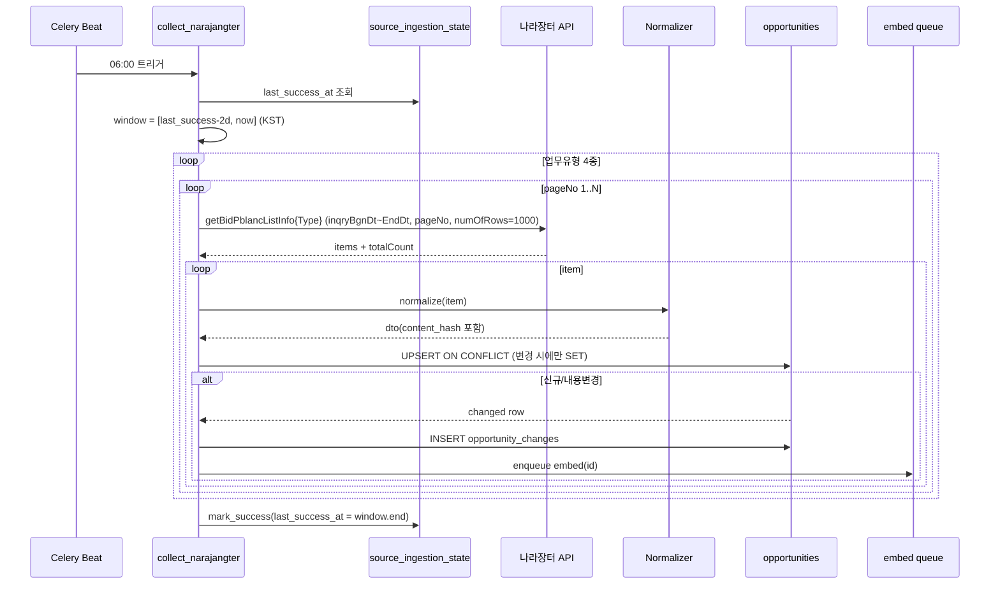

# 나라장터 Collector 설계

> P0 첫 수집기. 입찰공고를 매일 증분 수집 → 정규화 → UPSERT → 변경감지 → 재임베딩 큐 등록.
> 관련: [P0 API 스펙 §1](p0-source-spec.md) · [통합 스키마](db-schema-opportunities.md) · [수집·갱신 설계](data-ingestion.md)
> 스택: FastAPI · SQLAlchemy · Celery + Redis · Qdrant · **작성 기준일:** 2026-06-17

> 나라장터를 **1순위**로 삼는 이유: 정식 Open API·실시간 갱신·필드가 풍부해, 여기서 검증한 `수집→정규화→UPSERT→재임베딩` 파이프라인을 이후 3종(기업마당·K-Startup·NTIS)이 재사용한다.

---

## 1. 범위 & 원칙

- **대상:** 입찰공고정보서비스 4개 업무유형(물품/용역/공사/외자)을 각각 호출.
- **증분(Incremental):** 게시일시 기준 `[last_success_at − 버퍼, now]` 윈도우만 수집.
- **멱등(Idempotent):** 같은 윈도우 재실행해도 `(source, source_uid)` UPSERT로 안전.
- **부분 실패 격리:** 4개 업무유형은 독립 처리, 하나 실패가 전체를 막지 않음.
- **시간대:** 나라장터 일시는 **KST(Asia/Seoul)**. 요청 파라미터·파싱 모두 KST 기준, 저장은 `timestamptz`.

---

## 2. 컴포넌트 구조

```
┌──────────────────────────────────────────────┐
│ Celery Beat (06:00 KST)                       │
│   → task: collect_narajangter()               │
└───────────────┬──────────────────────────────┘
                ▼
   for biz_type in [물품,용역,공사,외자]:        ← 각각 독립 subtask 권장
        ▼
   NarajangterClient.fetch(op, window, page…)   ← HTTP/재시도/페이징
        ▼
   normalize(raw_item) → OpportunityDTO         ← 필드매핑/날짜·예산 파싱/해시
        ▼
   OpportunityRepository.upsert(dto)            ← ON CONFLICT, 변경분 반환
        ▼
   on change → log opportunity_changes
             → enqueue embed_opportunity(id)    ← Qdrant 재임베딩
        ▼
   SourceStateRepository.mark_success(window_end)
```

---

## 3. 시퀀스



---

## 4. 증분 윈도우 로직

```
buffer        = 2 days                       # 지연 게시·정정 공고 누락 방지
window.end    = now(KST)
window.begin  = state.last_success_at - buffer
                ?? now - BACKFILL_DAYS        # 최초 실행 시 백필(예: 90일)
```

- `last_success_at`은 **윈도우 end**로 갱신(부분 진행 중 크래시 대비 → 성공 시에만 커밋).
- 최초 1회 백필은 90일을 **N일 단위 청크**로 끊어 호출(타임아웃·과대응답 회피).
- 버퍼로 인한 재수집분은 UPSERT가 흡수(중복 무해).

---

## 5. API 클라이언트

- **Base:** `https://apis.data.go.kr/1230000/BidPublicInfoService`
- **오퍼레이션:** `getBidPblancListInfoThng|Servc|Cnstwk|Frgcpt`
- **고정 파라미터:** `serviceKey`(decoded 키는 라이브러리가 인코딩), `inqryDiv=1`, `type=json`, `numOfRows=1000`
- **가변:** `inqryBgnDt`,`inqryEndDt`(`YYYYMMDDHHMM`), `pageNo`

**페이지네이션 종료 조건**
- `totalCount`로 총 페이지 계산, 또는 `len(items) < numOfRows` 이면 종료.
- 안전상 `MAX_PAGES` 상한 + 초과 시 경고 로그.

**신뢰성**
- 타임아웃(connect/read), HTTP 5xx·타임아웃·`response.header.resultCode != '00'` → **지수 백오프 재시도**(Celery `autoretry_for`, `retry_backoff`, `max_retries=5`).
- 인증/쿼터 오류(`resultCode` 30/22 등)는 재시도 무의미 → 즉시 실패 + Sentry 알림.
- 호출 간 소량 지연(throttle)로 rate limit 보호. (개발키 1,000/일 → 4유형×수페이지는 충분, 운영 전환 기준은 data-ingestion §5)

---

## 6. 정규화 매핑 (→ `opportunities`)

| 컬럼 | 나라장터 필드 | 처리 |
|---|---|---|
| `source` | — | 상수 `'narajangter'` |
| `source_uid` | `bidNtceNo` | 차수 미포함(스키마 결정 #2) |
| `source_ord` | `bidNtceOrd` | int 변환 |
| `title` | `bidNtceNm` | trim |
| `agency` | `ntceInsttNm` ?? `dminsttNm` | 공고기관 우선 |
| `category` | (업무유형) | `'물품'/'용역'/'공사'/'외자'` |
| `budget_raw` | `presmptPrce` ?? `asignBdgtAmt` | 원문 보존 |
| `budget_amount` | 〃 | 숫자만 추출 → BIGINT(원) |
| `posted_at` | `bidNtceDt` | KST 파싱 → tz-aware |
| `deadline` | `bidClseDt` | KST 파싱 |
| `detail_url` | `bidNtceDtlUrl` | 그대로 |
| `description` | (공고명+기관+요약 조합 또는 상세) | MVP는 가용 필드 합성 |
| `raw_json` | item 전체 | JSONB 보존 |
| `status` | — | `deadline < now → closed else open` (없으면 unknown) |
| `content_hash` | — | `sha256(title|agency|deadline|budget_amount|description)` |

**날짜 파싱:** 응답이 `"2026-06-16 18:00:00"` 또는 `YYYYMMDDHHMM` 혼재 가능 → 두 포맷 모두 시도 후 `Asia/Seoul` 로컬라이즈. 파싱 실패는 `NULL` + 경고(레코드는 버리지 않음).

---

## 7. UPSERT · 변경감지 · 재임베딩

- [통합 스키마 §7 UPSERT 패턴](db-schema-opportunities.md) 사용: `ON CONFLICT (source, source_uid) DO UPDATE … WHERE content_hash IS DISTINCT FROM EXCLUDED.content_hash`.
- **변경 판정:** UPDATE로 실제 갱신된 행만 변경분. PostgreSQL `RETURNING id, (xmax<>0) AS updated` 또는 신규/변경 구분 후:
  - 신규/변경 → `opportunity_changes`(old/new hash, old/new ord, diff) 적재 + `embed_opportunity(id)` enqueue.
  - 해시 동일 → `last_seen_at`만 경량 UPDATE(임베딩 큐 등록 안 함).
- **정정공고:** `bidNtceOrd` 증가 시 보통 내용도 바뀌어 `content_hash` 변경 → 자동으로 변경이력+재임베딩. `old_ord/new_ord`로 차수 변화 기록.
- **재임베딩 워커:** `embed_opportunity(id)` 는 `content_hash != embedded_hash` 인 경우만 임베딩 생성 → Qdrant upsert(point id = `opportunities.id`) → `embedded_hash/embedded_at` 갱신. (멱등)

---

## 8. 상태 관리 (`source_ingestion_state`)

```
시작:  last_run_at=now, last_status='running'
성공:  last_success_at=window.end, last_status='success',
       collected_count=N, error_message=NULL
실패:  last_status='failed', error_message=traceback  (last_success_at 불변 → 다음 실행이 재시도)
```

`source='narajangter'` 단일 행으로 4유형 통합 관리(유형별 세분이 필요하면 `source_ingestion_state`를 (source, sub) 복합키로 확장).

---

## 9. 의사코드

```python
@celery.task(bind=True, autoretry_for=(TransientError,),
             retry_backoff=True, max_retries=5)
def collect_narajangter(self):
    state = state_repo.get_or_create("narajangter")
    window_end = now_kst()
    window_begin = (state.last_success_at - timedelta(days=2)
                    if state.last_success_at
                    else window_end - timedelta(days=BACKFILL_DAYS))
    state_repo.mark_running("narajangter")

    total = 0
    for op, category in NARAJANGTER_OPS:          # 4 업무유형
        for page in count(1):
            resp = client.fetch(op, inqry_bgn=window_begin, inqry_end=window_end,
                                 page_no=page, num_of_rows=1000)   # 재시도 내장
            items = resp.items
            for raw in items:
                dto = normalize(raw, category)     # 매핑 + 파싱 + content_hash
                result = opp_repo.upsert(dto)      # 변경 시에만 SET, 결과 반환
                if result.changed:
                    change_repo.insert(result.id, old=result.old_hash,
                                       new=dto.content_hash,
                                       old_ord=result.old_ord, new_ord=dto.source_ord)
                    embed_opportunity.delay(result.id)
                else:
                    opp_repo.touch_last_seen(result.id)
                total += 1
            if len(items) < 1000:                  # 마지막 페이지
                break

    state_repo.mark_success("narajangter", last_success_at=window_end,
                            collected_count=total)


def normalize(raw, category):
    return OpportunityDTO(
        source="narajangter",
        source_uid=raw["bidNtceNo"],
        source_ord=to_int(raw.get("bidNtceOrd")),
        title=raw["bidNtceNm"].strip(),
        agency=raw.get("ntceInsttNm") or raw.get("dminsttNm"),
        category=category,
        budget_raw=raw.get("presmptPrce") or raw.get("asignBdgtAmt"),
        budget_amount=parse_won(raw.get("presmptPrce") or raw.get("asignBdgtAmt")),
        posted_at=parse_kst(raw.get("bidNtceDt")),
        deadline=parse_kst(raw.get("bidClseDt")),
        detail_url=raw.get("bidNtceDtlUrl"),
        description=build_description(raw),
        raw_json=raw,
        status=derive_status(parse_kst(raw.get("bidClseDt"))),
        content_hash=sha256_norm(title, agency, deadline, budget_amount, description),
    )
```

---

## 10. 엣지 케이스

| 케이스 | 처리 |
|---|---|
| 정정공고(차수 증가) | content_hash 변경 → 변경이력 + 재임베딩, `old_ord/new_ord` 기록 |
| 동일 윈도우 재실행 | UPSERT로 무해(멱등) |
| 페이지 경계/누락 | `totalCount` + `<numOfRows` 이중 종료조건, `MAX_PAGES` 가드 |
| 날짜/예산 파싱 실패 | 해당 필드 NULL + 경고, 레코드는 보존 |
| 업무유형 1개 실패 | 해당 유형만 실패 처리, 나머지 계속(부분 격리) |
| 작업 중 크래시 | `last_success_at` 미갱신 → 다음 실행이 동일 윈도우 재수집 |
| 마감 지난 공고 | `status='closed'`로 저장(이력·분석용), 추천 단계에서 필터 |
| 응답 resultCode≠00 | 인증/쿼터=즉시실패+알림, 일시오류=백오프 재시도 |

---

## 11. 설정 (env)

```
NARAJANGTER_SERVICE_KEY=...        # data.go.kr 키 (Secret Manager)
NARAJANGTER_BASE_URL=https://apis.data.go.kr/1230000/BidPublicInfoService
INGEST_BUFFER_DAYS=2
INGEST_BACKFILL_DAYS=90
HTTP_TIMEOUT_CONNECT=5
HTTP_TIMEOUT_READ=30
INGEST_MAX_PAGES=200
```
스케줄: Celery Beat `crontab(hour=6, minute=0)` (Asia/Seoul), 07:00 매칭·08:00 알림과 정합.

---

## 12. 테스트 & 검증

- **단위:** `parse_kst`(두 포맷+실패), `parse_won`(원/억/콤마/빈값), `sha256_norm`(공백·대소문자 정규화), `derive_status`.
- **정규화:** 4유형 표본 JSON → DTO 스냅샷.
- **Repository(통합, 테스트DB):** 신규 INSERT → 동일 재실행(변경 없음) → 필드 변경 후 UPDATE+changes+재임베딩 enqueue 검증.
- **클라이언트:** 모킹으로 페이징 종료·5xx 재시도·resultCode 오류 분기.
- **E2E(샌드박스 키):** 1일 윈도우 실수집 → 행수>0, `last_success_at` 갱신, 큐 적재 확인.

---

## 13. 관측성
- 구조적 로그: `source, op, window, page, fetched, upserted, changed, elapsed`.
- 메트릭: 유형별 수집/변경 건수, 실패율, 소요시간, 재임베딩 큐 길이.
- 알림: 인증/쿼터 오류, 연속 실패, `collected_count=0`(이상징후) → Sentry/Langfuse.

---

## 14. 다음 단계
- [ ] `presmptPrce/bidNtceDt/bidClseDt/bidNtceDtlUrl` 등 **실응답 필드명 최종 확정**(명세/Swagger)
- [ ] `parse_won`·`build_description` 규칙 확정
- [ ] BaseCollector 추상화 → 기업마당/K-Startup/NTIS 재사용 → [BaseCollector & 기업마당 설계](collector-base-bizinfo.md)
- [ ] `embed_opportunity` 워커(Qdrant upsert) 상세 설계
