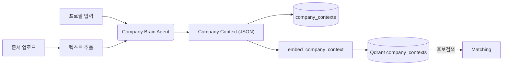

# Company Brain 설계

> 기업 프로필 + 업로드 문서(회사소개서 등)를 AI가 이해하여 **Company Context**(구조화된 기업 역량)를 생성하는 P0 핵심 기능. 매칭 엔진의 기업 측 입력이자 *핵심 자산*.
> 관련: [FSD FR-003·004·005](../03-spec/fsd.md) · [MVP PRD §5.1](../02-product/mvp-prd.md) · [통합 스키마 §10](db-schema-opportunities.md) · [embed 워커](embed-worker.md) · [Matching 엔진](matching-engine.md)
> 스택: FastAPI · SQLAlchemy · Celery · **pgvector(Postgres)** · (optional) Claude LLM · **작성 기준일:** 2026-06-18 (LLM optional·pgvector 개정 2026-06-20)

---

## 1. 역할 & 위치

- **입력:** 기업 프로필(회사명/업종/서비스/기술/주요고객/인증/지역) + 업로드 문서(PDF/DOCX/PPTX ≤50MB).
- **출력:** `Company Context` JSON(industry/technologies/customers/strengths/keywords …) → `company_contexts` 저장 → 임베딩 → 매칭에 사용.
- 수집기(공고 측)와 **대칭**: 공고는 Opportunity Radar, 기업은 Company Brain. 둘 다 임베딩되어 매칭 엔진에서 만난다.



---

## 2. 입력 처리

### 2.1 프로필 (FR-003)
필수: 회사명·업종·서비스·기술·주요고객·인증·지역. 폼 검증 후 구조화 입력.

### 2.2 문서 업로드 (FR-004)
- 포맷: PDF/DOCX/PPTX, ≤50MB. 저장: 오브젝트 스토리지(S3 호환), 원본 URL 보관.
- **텍스트 추출:** PDF(텍스트 레이어 → 없으면 OCR 폴백), DOCX/PPTX 파서. 길이 큰 문서는 청크 분할.
- 추출 실패/스캔본은 OCR 큐로(비동기), 부분 추출도 허용.

---

## 3. Company Context 생성 (FR-005)

### 3.1 처리 흐름
1. 프로필(구조화) + 문서 추출 텍스트(청크)를 합쳐 LLM에 투입.
2. LLM이 **구조화 스키마**로 추출/요약(근거 문장 포함).
3. 스키마 검증 → `context_json` 저장 → `content_hash` 산출 → 임베딩 enqueue.

### 3.2 Context 스키마

```jsonc
{
  "industry": "GIS",                       // 대표 산업(분류 매핑용)
  "industries": ["공간정보", "AI"],         // 복수 영역
  "technologies": ["디지털트윈", "공간분석", "LLM"],
  "services": ["공간데이터 구축", "분석 플랫폼"],
  "customers": ["LX", "LH"],               // 주요 고객/발주처
  "certifications": ["기업부설연구소", "ISO"],
  "regions": ["서울", "전국"],
  "track_records": [                        // 수행실적(매칭 '실적 일치' 핵심)
    {"title": "LX 디지털트윈 구축", "year": 2024, "client": "LX", "summary": "..."}
  ],
  "strengths": ["공공사업 경험", "공간정보 전문성"],
  "keywords": ["디지털트윈", "공간정보", "공공"]   // 검색/매칭 보조
}
```

> 매칭 가중치(기술30·실적25·고객20·산업15·지역10)와 1:1 대응: `technologies`↔기술, `track_records`↔실적, `customers`↔고객, `industry`↔산업, `regions`↔지역.

### 3.3 LLM 추출 원칙
- **근거 기반:** 문서/프로필에 없는 사실 생성 금지(환각 억제). 출처 없으면 비움.
- **구조화 출력 강제**(스키마 검증, 위반 시 재시도).
- 모델: 최신 Claude(Opus 4.8) — **optional·기본 OFF(2026-06-20).** LLM 없으면 `_profile_to_context()`로 **구조화 프로필만으로 Context 생성**(문서 AI 이해는 LLM 활성 시). `pip install .[llm]`+`ANTHROPIC_API_KEY` 시 청크 요약→통합(맵-리듀스) 활성.
- 산업 분류는 통제 어휘(매칭 `category` 매핑과 정합)로 정규화.

---

## 4. 저장 & 임베딩

- `company_contexts(company_id, context_json JSONB, content_hash, embedded_hash, embedded_at, embedding_version)` — [db-schema §10](db-schema-opportunities.md).
- `content_hash = sha256_norm(industry|technologies|customers|strengths|track_records)` → 변경 시 재임베딩.
- 임베딩 텍스트: Context 핵심 필드를 자연어로 직렬화([embed §3](embed-worker.md) 대칭) → Qdrant `company_contexts`(point id=`company_contexts.id`).
- 기업당 Context는 **버전 관리**(history) 권장: 프로필/문서 변경 시 새 버전 → 매칭 재계산 트리거.

---

## 5. 재생성 트리거

| 트리거 | 동작 |
|---|---|
| 프로필 수정 | Context 재생성 → content_hash 변경 시 재임베딩 + 해당 기업 재매칭 |
| 문서 추가/교체 | 추출 → Context 재생성 |
| 추출 스키마/모델 버전 변경 | 일괄 재생성(버전 필드) |
| 최초 온보딩 완료 | Context 생성 → 전체 열린 공고 대상 1회 풀매칭([matching §6](matching-engine.md)) |

---

## 6. 의사코드

```python
@celery.task(bind=True, autoretry_for=(TransientError,), retry_backoff=True, max_retries=3)
def build_company_context(self, company_id):
    profile = company_repo.get_profile(company_id)
    docs = doc_repo.list_extracted_text(company_id)        # 추출 완료 텍스트(청크)
    chunks = chunk_and_pack(profile, docs)

    if len(chunks) > 1:                                    # 긴 문서: 맵-리듀스
        partials = [llm_extract(c, schema=CONTEXT_SCHEMA) for c in chunks]
        context = llm_merge(partials, schema=CONTEXT_SCHEMA)
    else:
        context = llm_extract(chunks[0], schema=CONTEXT_SCHEMA)

    validate(context, CONTEXT_SCHEMA)                      # 위반 시 재시도
    h = sha256_norm(context["industry"], context["technologies"],
                    context["customers"], context["strengths"], context["track_records"])
    cc_id = cc_repo.upsert(company_id, context_json=context, content_hash=h)
    if cc_repo.hash_changed(cc_id):
        embed_company_context.delay(cc_id)                 # 재임베딩
        rematch_company.delay(company_id)                  # 기업 재매칭
```

문서 추출(비동기 선행):
```python
@celery.task
def extract_document(doc_id):
    f = storage.get(doc_id)
    text = extract_pdf(f) or ocr(f) if is_pdf(f) else extract_office(f)
    doc_repo.save_text(doc_id, text, status="extracted")
    build_company_context.delay(doc_repo.company_id(doc_id))
```

---

## 7. 엣지 케이스

| 케이스 | 처리 |
|---|---|
| 스캔 PDF(텍스트 없음) | OCR 폴백, 실패 시 프로필만으로 Context 생성 |
| 문서 없음(프로필만) | 프로필 기반 Context 생성(품질 낮음 표시) |
| LLM 스키마 위반 | 검증 실패 → 재시도, 반복 실패 시 부분 Context + 경고 |
| 초장문 문서 | 청크 맵-리듀스, 토큰 상한 관리 |
| 민감정보 | 업로드 문서 접근통제·암호화([FSD 보안](../03-spec/fsd.md)) |
| 추출 일부 실패 | 가용 텍스트로 진행(부분 허용) |

---

## 8. 검증 & 다음 단계
- [ ] PDF/DOCX/PPTX 추출 + OCR 폴백 파이프라인
- [ ] `CONTEXT_SCHEMA` 확정(매칭 가중치 필드와 1:1)
- [ ] 맵-리듀스 추출/병합 프롬프트 + 스키마 검증·재시도
- [ ] 산업/지역 통제 어휘(매칭 category·region 매핑과 정합)
- [ ] `company_contexts` 버전 관리(history) 도입 여부 결정
- [ ] embed/매칭 재계산 트리거 연결(온보딩·수정 시)
