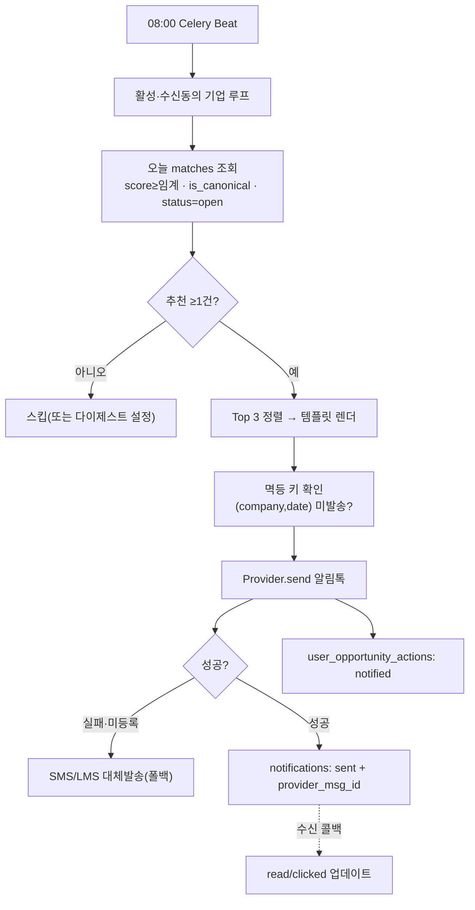

# Daily Briefing / 카카오 알림 설계

> 파이프라인의 **마지막 전달 단계**. 매일 08:00(KST) 기업별 추천 Top 3를 카카오톡으로 전달하고, 도달·열람·클릭을 추적한다(North Star 퍼널의 *Opened/Reviewed* 진입점).
> 관련: [Matching 엔진](matching-engine.md) · [표시 dedup](display-dedup.md) · [MVP PRD §5.5](../02-product/mvp-prd.md) · [FSD FR-010](../03-spec/fsd.md) · [Architecture §3 Notification](architecture.md)
> 스택: FastAPI · Celery · 카카오 비즈메시지(중계사) · **작성 기준일:** 2026-06-18

---

## 1. 역할 & 위치

- **입력:** `matches`(score ≥ 임계, `is_canonical`, opportunity `status=open`) → 기업별 상위 정렬.
- **출력:** 카카오 메시지(추천 Top 3) + 상세보기 딥링크. 발송 결과·열람·클릭 기록.
- **시각:** 매일 **08:00**(표준 타임라인, [정합성 리뷰 §3](../00-overview/design-consistency-review.md)). 매칭(07:00) 직후.
- **추천 건수(확정):** **카카오 알림 = Top 3**, **웹 대시보드 = 5건**(리뷰 G3). `notifications`는 카카오 Top 3 기준.
- **대상·연락처(확정):** 발송 단위 = **company**. `companies.phone` + `notification_settings`(enabled/channel/send_hour/send_empty), users N:1 companies (리뷰 G1·G2, [db-schema §11](db-schema-opportunities.md)).

---

## 2. 카카오 채널 정책 (핵심 제약)

> ⚠️ 카카오 비즈메시지는 **직접 발송 불가** — 발신프로필(카카오톡 채널) + **메시지 중계사(대행사)** + **템플릿 사전 심사**가 전제. 정보성/광고성 분류에 따라 규정이 다르다.

| 유형 | 대상 | 특징 | 야간발송 | 추천 적합성 |
|---|---|---|---|---|
| **알림톡(AlimTalk)** | 전화번호(친구 아니어도 O) | **정보성**, 템플릿 심사, 변수 `#{}` | 가능(정보성) | ✅ 도달률↑·친구불필요 → **1순위** |
| **친구톡(FriendTalk)** | 채널 친구만 | 광고성 가능, 이미지/리치, 수신거부 필수 | 20~08시 제한 | 리치 콘텐츠용 보조 |

- **결정:** **이메일 = MVP 1차 채널**(비드라온 벤치마킹, [competitor-bidraon-ux §4](../05-spikes/competitor-bidraon-ux.md)) — 카카오는 사업자등록·발신프로필·템플릿 심사가 선행이라, **이메일은 의존 없이 즉시 발송 가능**. **알림톡은 사업자 확보 후 1순위**(정보성 일일 요약), 친구톡은 리치 보조.
- 🔄 **개정(2026-06-20): 이메일 발송 제거 → 카카오톡이 본 계획.** 사용자 결정(메일보다 카카오톡). `EmailProvider`·render·SMTP 설정·이메일 테스트 **삭제**, `send_*` 태스크는 안전 stub(Beat 11:00 skip, 에러 없음), `NotificationSetting.channel` 기본 **`alimtalk`**. **카카오 알림톡(`SolapiProvider`)은 사업자등록+발신프로필+템플릿 심사 후 구현** (이전 이메일 구현은 git 이력 보존)
- ✅ **카카오 재배선(2026-06-20, test-mode):** `SolapiProvider.send_alimtalk`(SOLAPI API + HMAC-SHA256, 키게이트) + `send_company_briefing` 카카오 재구현(Top 3·수신자=`companies.phone`·멱등 `(company,date)`·SMS 폴백·`notifications`(channel=alimtalk)·`notified` 액션). `send_daily_briefings` 대상 = **`enabled AND active_subscribed`**(구독 게이트). 외부 HTTP 모킹 테스트. **live = 사업자등록+발신프로필(pfId)+템플릿(`#{}`) 심사 후 실키 주입.**
- ⚠️ "오늘의 추천 사업"이 **정보성/광고성 어디에 해당하는지 카카오 심사·법무 검토 필요**(특정 사업 추천이 광고성으로 분류될 여지). 템플릿 문구는 정보성 기준으로 설계.
- **중계사:** NHN Cloud / 비즈뿌리오 / Solapi 등 1곳 선정 → `NotificationProvider` 인터페이스로 추상화(교체 가능).

---

## 3. 메시지 템플릿 (알림톡, 변수화)

```
[BizRadar] 오늘의 추천 사업

#{회사명}님께 맞는 사업 #{건수}건을 찾았어요.

1. #{공고1명} (적합도 #{점수1})
   예상규모 #{규모1} · 마감 #{디데이1}
2. #{공고2명} (적합도 #{점수2})
3. #{공고3명} (적합도 #{점수3})

▶ 자세히 보기
```
- 버튼: **상세보기**(웹 딥링크, 추적 파라미터 포함) / (선택) **채널 추가**.
- 변수는 심사 통과 템플릿의 `#{}` 자리표시자에 런타임 주입. 자유서술 불가 → 고정 골격 + 변수.
- 추천 0건 처리: §5.

---

## 4. 발송 흐름



---

## 5. 멱등 · 추천 0건 · 수신설정

- **멱등:** `(company_id, briefing_date)` 유니크 → 재실행/재시도해도 1일 1회. 부분 실패는 미발송분만 재시도.
- **추천 0건:** 기본 **스킵**(노이즈 방지). 설정으로 "추천 없음" 또는 주간 다이제스트 전환 가능(습관 형성 ↔ 피로 트레이드오프).
- **수신설정:** 설정>알림([architecture Settings](architecture.md))에서 on/off·시간대. 광고성(친구톡) 발송 시 **수신거부 안내 필수**.
- **조용시간:** 08:00 발송은 규정 내. 친구톡 야간(20~08) 금지 준수.

---

## 6. 도달·클릭 추적 (퍼널)

| 이벤트 | 기록 | 지표(MVP PRD) |
|---|---|---|
| 발송 | `notifications.status=sent` + `user_opportunity_actions(notified)` | 발송수 |
| 열람 | 중계사 수신 콜백 → `read_at` | **Notification Open Rate** |
| 클릭(상세보기) | 추적 링크 → `user_opportunity_actions(opened/clicked)` | **Opportunity Click Rate** |
| 관심/참여 | 웹 액션 | Saved/Participation Rate |

- 상세보기 URL에 `match_id`·`utm`·서명 토큰 → 클릭 시 매핑·진위 검증. 도착지 = [공고 상세 API](dashboard-api.md)(`opened` 기록).
- 카카오 열람 콜백 제공 범위는 중계사·메시지 유형별 상이 → 클릭 기반 지표를 1차로 신뢰.

---

## 7. 저장 모델 (신규 `notifications`)

> SSOT는 db-schema. 본 테이블은 **마이그레이션 `0005_notifications`** 로 추가([db-schema §9.6 색인](db-schema-opportunities.md)).

```sql
CREATE TABLE notifications (
    id            UUID PRIMARY KEY DEFAULT gen_random_uuid(),
    company_id    UUID NOT NULL REFERENCES companies(id),
    briefing_date DATE NOT NULL,
    channel       TEXT NOT NULL,            -- 'alimtalk' | 'friendtalk' | 'sms'
    template_code TEXT,
    payload       JSONB NOT NULL,           -- 렌더 변수 + match_ids
    status        TEXT NOT NULL,            -- queued|sent|failed|fallback_sent
    provider      TEXT,
    provider_msg_id TEXT,
    error_message TEXT,
    sent_at       TIMESTAMPTZ,
    read_at       TIMESTAMPTZ,
    created_at    TIMESTAMPTZ NOT NULL DEFAULT now(),
    CONSTRAINT uq_notif_company_date UNIQUE (company_id, briefing_date)
);
CREATE INDEX idx_notif_status ON notifications (status);
```

---

## 8. 의사코드

```python
@celery.task
def send_daily_briefings():
    for company in company_repo.active_subscribed():       # 수신동의·활성
        send_company_briefing.delay(company.id, today_kst())

@celery.task(bind=True, autoretry_for=(TransientError,), retry_backoff=True, max_retries=4)
def send_company_briefing(self, company_id, date):
    if notif_repo.exists(company_id, date):                # 멱등
        return
    cfg = notif_settings_repo.get(company_id)              # notification_settings
    if not cfg.enabled:
        return
    matches = match_repo.top_for_company(company_id, limit=BRIEFING_TOP_N,  # =3 (카카오)
                  min_score=THRESHOLD, canonical_only=True, status="open")
    if not matches and not cfg.send_empty:
        return
    payload = render_template(company_id, matches)
    notif = notif_repo.create(company_id, date, channel="alimtalk",
                              payload=payload, status="queued")
    try:
        res = provider.send_alimtalk(company.phone, TEMPLATE_CODE, payload)
        notif_repo.mark_sent(notif.id, provider_msg_id=res.id)
    except NotRegisteredOrBlocked:
        res = provider.send_sms(company.phone, to_sms(payload))   # 폴백
        notif_repo.mark(notif.id, status="fallback_sent", provider_msg_id=res.id)
    action_repo.log(company_id, [m.opportunity_id for m in matches], "notified")
```

---

## 9. 엣지 케이스

| 케이스 | 처리 |
|---|---|
| 추천 0건 | 기본 스킵, 설정 시 다이제스트 |
| 알림톡 미등록/차단 | SMS/LMS 대체발송(폴백) |
| 중계사 일시 오류 | 백오프 재시도, 멱등으로 중복 방지 |
| 템플릿 미승인/변수 불일치 | 발송 차단·알림(사전 검증) |
| 수신거부 기업 | 발송 제외 |
| 전화번호 누락/오류 | 스킵 + 온보딩 보완 유도 |
| 열람 콜백 미지원 | 클릭 지표로 대체 |

---

## 10. 설정 (env)

```
KAKAO_PROVIDER=nhn_cloud            # nhn_cloud | bizppurio | solapi ...
KAKAO_SENDER_KEY=...                # 발신프로필(채널) 키
KAKAO_TEMPLATE_BRIEFING=...         # 승인된 알림톡 템플릿 코드
NOTIFY_SEND_HOUR=8                  # KST
NOTIFY_FALLBACK_SMS=true
BRIEFING_TOP_N=3
```

---

## 11. 검증 & 다음 단계
- [ ] 중계사 선정 + 발신프로필(채널) 개설
- [ ] **알림톡 템플릿 정보성 설계 → 카카오 심사 통과**(법무 검토: 정보성/광고성)
- [ ] `notifications` 마이그레이션 `0005` 작성(db-schema 색인 반영)
- [ ] 상세보기 추적 링크(서명 토큰) + 클릭→`user_opportunity_actions` 연결
- [ ] SMS 폴백·수신거부·조용시간 규정 준수 검증
- [ ] 발송/열람/클릭 지표 대시보드(Notification Open Rate, Click Rate)
