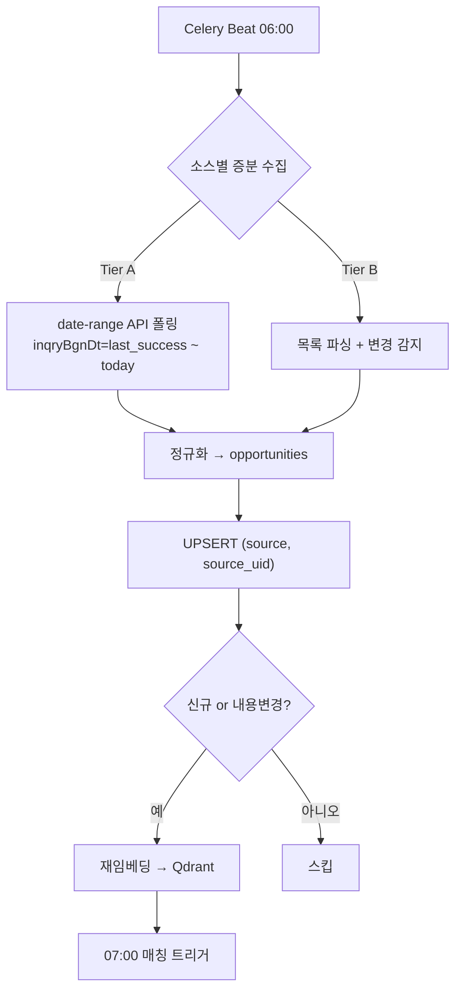

# 데이터 소스 카탈로그 & 수집·갱신 설계

> BizRadar AI의 핵심 입력인 **사업공고 데이터**의 출처, 수집 방식, 최신 데이터 갱신(증분/중복제거/변경감지) 전략을 정의한다.
> 관련: [FSD FR-006/007](../03-spec/fsd.md), [Architecture §8 Scheduler](architecture.md), [데이터 소스 우선순위 확정](../00-overview/service-analysis.md)
> **작성 기준일:** 2026-06-17

---

## 1. 수집 방식 분류 (Tier)

소스마다 "공식 Open API 제공 여부"가 다르므로, 수집 난이도/안정성 기준으로 3개 Tier로 나눈다.

| Tier | 특징 | 수집 방식 | 안정성 |
|---|---|---|---|
| **A. 공식 Open API** | data.go.kr 등에서 REST(JSON/XML) 제공, 날짜 범위 조회 | API 폴링(증분) | 높음 ✅ |
| **B. 웹/RSS** | 공식 API 없음, 공고 목록 페이지·RSS만 존재 | HTML 파싱 / RSS 구독 | 중간 ⚠️ |
| **C. 혼합·P1** | 일부 API + 일부 웹, 우선순위 후순위 | 케이스별 | 낮음 |

> **원칙:** 가능한 한 Tier A로 끌어올린다. Tier B 소스도 상당수는 **기업마당(중기부)·K-Startup 통합공고 API**가 메타데이터를 재수집하므로, *원천 스크래핑보다 집계 API를 우선* 검토한다.

---

## 2. 소스별 카탈로그 (확정 P0 + P1)

> 📑 **P0 4종 구현용 상세 스펙**(엔드포인트·파라미터·필드·통합매핑·구현순서): [p0-source-spec.md](p0-source-spec.md)
> 🛠 **수집기 설계**: [나라장터](collector-narajangter.md)(1순위) · [BaseCollector & 기업마당](collector-base-bizinfo.md) · [K-Startup·NTIS](collector-kstartup-ntis.md)
> 🔗 **하류 파이프라인**: [embed 워커](embed-worker.md) → [Matching 엔진](matching-engine.md) · [표시 dedup](display-dedup.md)

### P0 — 우선 구현 (service-analysis §8 확정)

| 소스 | 운영기관 | Tier | 수집 경로 | 비고 |
|---|---|---|---|---|
| **나라장터** | 조달청 | A ✅ | data.go.kr `15129394` 입찰공고정보서비스 (REST, 실시간 갱신) | 업무유형별(물품/용역/공사/외자) 오퍼레이션 분리. `15129427` 계약정보, `15058815` 개방표준 보조 활용 |
| **K-Startup** | 창업진흥원 | A ✅ | data.go.kr `15125364`(사업공고 조회), `15112711`(창업지원공고) + K-Startup 자체 Open API(지원사업/통합공고) | JSON/XML |
| **NIPA** | 정보통신산업진흥원 | B ⚠️ | 알림마당 사업공고 목록(`nipa.kr/home/2-2`) 파싱. data.go.kr는 파일데이터(세부사업)만 → 실시간 부적합 | **지원사업(그랜트)형 공고**는 기업마당이 상당수 커버 → 1차 기업마당, 누락분만 스크래핑 |
| **NIA** | 한국지능정보사회진흥원 | B ⚠️ | 공고 목록 페이지 파싱 | 그랜트형은 기업마당 교차 커버, R&D 과제는 NTIS/IRIS |
| **IITP** | 정보통신기획평가원 | B ⚠️ | R&D 과제는 **NTIS/IRIS 우선**, 기관 고유 공고만 `ezone.iitp.kr` 파싱 | ICT R&D 과제 중심 |

### 집계 소스 (P0 강력 권장 추가)

| 소스 | 운영기관 | Tier | 수집 경로 | 커버 영역 |
|---|---|---|---|---|
| **기업마당(Bizinfo)** | 중소벤처기업부 | A ✅ | `bizinfo.go.kr` 지원사업정보 API(`bizinfoApi`) | **정부지원사업(그랜트)** 집계 — 중앙부처·지자체·유관기관. 분야: 금융/기술/인력/수출/판로(내수)/창업/경영 등. 필드: 분야/사업명/신청시작·종료일/소관·수행·접수기관/등록일/상세URL |
| **NTIS 국가R&D통합공고** | 과기정통부/KISTEP | A/C | `ntis.go.kr` 공고 + data.go.kr API | **R&D 과제 공모** 통합 — IITP/NRF/TIPA 등 부처 R&D를 한곳에 |
| **IRIS 범부처통합연구지원시스템** | 부처 공통 | B/C | `iris.go.kr` 사업공고 | R&D 과제 접수 포털(NTIS와 상보) |

### P1 — 확장 (PMF 이후)

| 소스 | 운영기관 | Tier | 수집 경로 |
|---|---|---|---|
| LH | 한국토지주택공사 | A/C | data.go.kr 입찰/공고 API 확인 후 API 우선 |
| LX | 한국국토정보공사 | B/C | 공고 페이지 파싱 |
| 국토부 / 환경부 | 부처 | B/C | 부처 공고·나라장터 교차 |
| KOICA | 한국국제협력단 | B/C | 입찰·용역 공고 페이지 |

> ⚠️ **정확도 주의:** API ID·오퍼레이션명·파라미터는 본 문서 작성 시점의 공개정보 기준이다. 실제 구현 전 각 `openapi.do` 상세/Swagger 및 참고자료(.docx)로 **엔드포인트·파라미터·요청 제한을 재확인**할 것.

### 공고 유형 × 소스 커버리지 (집계 API의 한계)

BizRadar가 약속한 범위는 **입찰 · 정부지원사업 · R&D 과제 · 실증사업 · 컨소시엄 · PoC** 6종이다. 기업마당은 이 중 **"정부지원사업" 한 조각**만 덮는다 — 단일 소스로 전부 커버 불가.

| 공고 유형 | 기업마당 | 주 수집 소스 |
|---|---|---|
| 입찰·조달(용역/공사/물품) | ❌ 미포함(지원사업 아님) | **나라장터** |
| 정부지원사업(금융/기술/수출/창업 등) | ✅ 집계 | **기업마당**(+ K-Startup 창업 분야) |
| R&D 과제 공모 | △ 일부 "기술개발 지원사업 통합공고"만 | **NTIS / IRIS**(+ IITP·NRF·TIPA) |
| 실증사업 | △ 정부주관 일부만 | 부처·기관 공고 + 나라장터 |
| 컨소시엄 모집 | ❌ | 기관/민간 공고 스크래핑 |
| 민간 PoC·협력사업 | ❌ | 민간 채널(별도 설계, P2) |

**기업마당 API 자체의 추가 한계**
- 메타데이터 + **상세URL만** 제공 → 필수자격·평가항목·예산 상세는 **상세 본문 별도 수집(detail fetch) + LLM 추출** 필요.
- **중소기업(SME) 정책 중심** → 비SME·대형 사업 일부 누락 가능.
- 분야 미분류·등록 지연 공고는 빠질 수 있어, 핵심 기관은 **원천 교차검증(NIPA 등)** 병행 권장.

> 정리: 기업마당은 "정부지원사업 그랜트형"의 **스크래핑 대체재**로 가치가 크지만, **입찰=나라장터 / R&D=NTIS·IRIS**는 반드시 별도로 둬야 한다.

---

## 3. 통합 스키마 정규화

각 소스의 상이한 응답을 단일 `opportunities` 스키마로 정규화한다. ([Architecture §5](architecture.md) DB)

| 통합 필드 | 나라장터 예 | K-Startup 예 | 기업마당 예 |
|---|---|---|---|
| `source` | `narajangter` | `kstartup` | `bizinfo` |
| `source_uid` (자연키) | 입찰공고번호+차수(`bidNtceNo`+`bidNtceOrd`) | 공고일련번호 | `pblancId` |
| `title` | 입찰공고명 | 사업공고명 | 사업명 |
| `agency` | 수요기관/공고기관 | 주관기관 | 소관·수행기관 |
| `budget` | 추정가격/기초금액 | (별도) | (별도/본문) |
| `deadline` | 입찰마감일시 | 신청종료일 | 신청종료일 |
| `posted_at` | 공고게시일시 | 공고일 | 등록일 |
| `description` | 공고내용 | 사업개요 | 분야+요약 |
| `detail_url` | 나라장터 상세 | K-Startup 상세 | 상세URL |
| `raw_json` | 원본 전체 보존 | 〃 | 〃 |

- `source_uid`는 **소스 내 유일키**. 전역 dedup 키 = `(source, source_uid)`.
- 매핑이 불완전한 필드(budget 등)는 본문 LLM 추출로 보강.

---

## 4. 최신 데이터 갱신(Refresh) 전략

### 4.1 증분 수집 (Incremental)
- **Tier A:** 조회 파라미터에 `조회시작일 = 소스별 last_success_at - 안전버퍼(예: 2일)`, `조회종료일 = 오늘`. 페이지네이션(`pageNo`/`numOfRows`) 끝까지 순회. 안전버퍼로 지연 게시·정정 공고 누락 방지.
- **Tier B:** 목록 1페이지부터 "이미 본 `source_uid`"를 만날 때까지(또는 N일치) 역순 수집.
- 최초 1회는 **백필(backfill)**: 과거 N개월 일괄 적재 후 증분 전환.

### 4.2 중복 제거 & UPSERT
- `(source, source_uid)` 유니크 제약 + `INSERT ... ON CONFLICT DO UPDATE`.
- 신규/변경만 다운스트림(임베딩·매칭)으로 전파.

### 4.3 변경 감지 (Change Detection)
- 정규화 후 핵심 필드(title/deadline/budget/description) 기준 `content_hash` 저장.
- 해시 변경 시: `updated_at` 갱신 + 재임베딩 + (선택) 변경이력 테이블 적재.
- **나라장터 정정공고(공고차수)** 는 `bidNtceOrd`를 `source_uid`에 포함해 차수별로 추적하거나, 최신 차수만 유효 처리하는 정책 중 택1(권장: 최신 차수 유효 + 이력 보존).

### 4.4 스케줄 (Architecture §8 정합)
| 시각 | 작업 | 비고 |
|---|---|---|
| 06:00 | 소스별 증분 수집 → 정규화 → UPSERT → 재임베딩 | 소스별 Celery task 병렬, 실패 격리 |
| 07:00 | 매칭(적합도 계산) | 신규/변경 공고 대상 |
| 08:00 | 카카오톡 Daily Briefing | Top 3 |

### 4.5 신뢰성 & 멱등성
- 각 task **멱등** 설계(중복 실행해도 UPSERT로 안전).
- 소스별 상태 테이블: `last_success_at`, `last_status`, `collected_count`, `error`.
- 실패 시 지수 백오프 재시도(Celery retry), 연속 실패 → Sentry/Langfuse 알림.
- API 호출은 소스별 rate limit 준수(클라이언트 측 throttle).

---

## 5. 인증키 / 트래픽 운영

| 항목 | 내용 |
|---|---|
| 발급 | data.go.kr 활용신청 → 자동승인 또는 심의승인 |
| 개발계정 | 일 약 **1,000건** (개발·테스트용) |
| 운영계정 | 일 최대 **100,000건** (활용사례 제출 시 상향) |
| 키 관리 | 환경변수/Secret Manager 보관, 코드·git 노출 금지, 정기 로테이션 |
| 사용량 모니터링 | 일일 호출량 추적, 임계 80% 알림 → 운영계 상향 신청 트리거 |

> MVP 초기엔 개발계정으로 시작하되, P0 소스가 늘면 **조기에 운영계정 상향**을 신청한다(승인 리드타임 존재).

---

## 6. 스크래핑(Tier B) 준수사항
- 각 사이트 `robots.txt`·이용약관 확인, 과도한 요청 금지(요청 간 지연·동시성 제한).
- User-Agent 명시, 변경에 강한 선택자(셀렉터) 사용 + DOM 변경 감지 시 알림.
- 가능하면 **공식 API/집계 API(기업마당)로 대체**하여 스크래핑 의존도 최소화.

---

## 7. 구현 체크리스트
- [ ] data.go.kr 개발계정 발급, P0 3종(나라장터·K-Startup·기업마당) 활용신청
- [ ] 각 API `openapi.do`/Swagger·참고자료로 엔드포인트·파라미터·필드 확정
- [ ] `opportunities` 통합 스키마 + `(source, source_uid)` 유니크 제약 마이그레이션
- [ ] 소스별 Collector(증분/페이지네이션/정규화) + 소스 상태 테이블
- [ ] `content_hash` 변경감지 + 재임베딩 파이프라인(Qdrant)
- [ ] Celery Beat 06:00 스케줄, 멱등·재시도·실패 알림
- [ ] R&D 과제는 NTIS/IRIS API·공고로 별도 수집(입찰=나라장터와 분리)
- [ ] 기업마당 상세URL → 상세 본문 detail fetch + LLM 추출(자격/평가항목/예산)
- [ ] NIPA/NIA/IITP: 기업마당·NTIS 커버리지 측정 → 부족분만 스크래퍼 추가
- [ ] 운영계정 상향 신청 기준(호출량 임계) 수립

---

## 부록 — 출처

- [조달청_나라장터 입찰공고정보서비스 (data.go.kr 15129394)](https://www.data.go.kr/data/15129394/openapi.do)
- [조달청_나라장터 계약정보서비스 (15129427)](https://www.data.go.kr/data/15129427/openapi.do)
- [창업진흥원_K-Startup 조회서비스 (15125364)](https://www.data.go.kr/data/15125364/openapi.do)
- [창업진흥원_창업지원공고 K-Startup (15112711)](https://www.data.go.kr/data/15112711/openapi.do)
- [K-Startup 지원사업 공고 Open API](https://nidview.k-startup.go.kr/view/public/kisedKstartupService/announcementInformation)
- [기업마당(Bizinfo) 정책정보 개방 API 목록](https://www.bizinfo.go.kr/web/lay1/program/S1T175C174/apiList.do)
- [NTIS 국가R&D통합공고](https://www.ntis.go.kr/rndgate/eg/un/ra/mng.do)
- [IRIS 범부처통합연구지원시스템 사업공고](https://www.iris.go.kr/contents/retrieveBsnsAncmBtinSituListView.do)
- [NIPA 사업공고 알림마당](https://www.nipa.kr/home/2-2)
- [IITP 사업공고(ezone)](https://ezone.iitp.kr/common/anno/list)
- [공공데이터포털 OpenAPI 이용가이드](https://www.data.go.kr/ugs/selectPublicDataUseGuideView.do)
