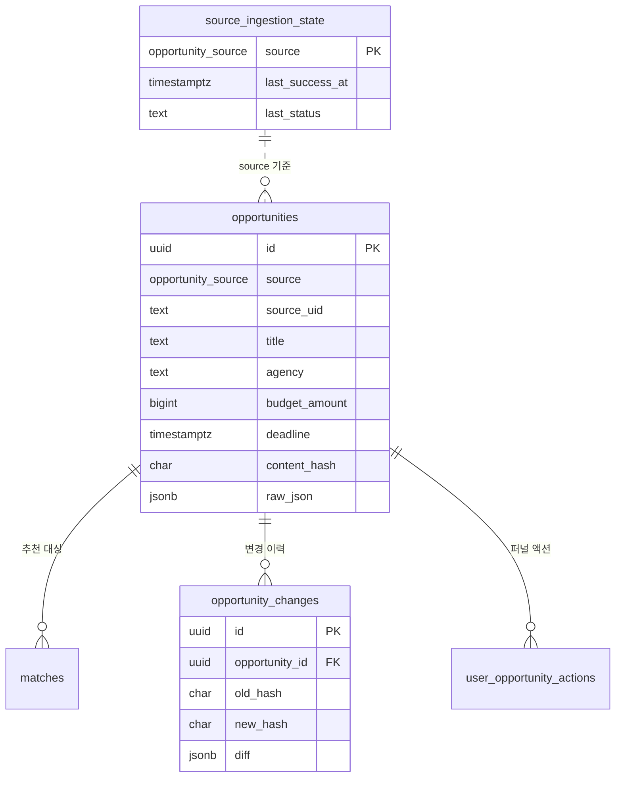

# `opportunities` 통합 스키마 & 마이그레이션 초안

> P0 4종(나라장터·기업마당·K-Startup·NTIS)을 단일 테이블로 정규화하기 위한 DB 설계.
> 관련: [P0 API 스펙](p0-source-spec.md) · [수집·갱신 설계](data-ingestion.md) · [Architecture §5 DB](architecture.md)
> 스택: PostgreSQL + SQLAlchemy + Alembic · **작성 기준일:** 2026-06-17

이 문서는 [Architecture §5](architecture.md)의 `opportunities` 스케치(id/title/agency/budget/deadline/description/source)를 **확장·정식화**한다.

> 🔧 **개정 v2 (2026-06-18) — [§9 스키마 보강](#9-스키마-보강-개정-v2-2026-06-18) 참조.** 아래 §3~§5(v1 base) 중 다음 3가지가 §9로 **갱신(supersede)**된다: ① `source` ENUM → `sources` 룩업 테이블 FK, ② `status` 유지 방식(생성열 불가 → upsert + 일일 sweep), ③ `matches` FK 정합 + 추천/조회 복합 인덱스 추가. 신규 구축 시 §3 + §9를 함께 적용(추가 마이그레이션 `0003`).

---

## 1. 설계 결정 (defaults — 합리적 기본값으로 확정하고 진행)

| # | 결정 | 이유 |
|---|---|---|
| 1 | **`(source, source_uid)` 자연키 + UPSERT** | 소스별 공고 유일키로 멱등 수집·중복 제거 |
| 2 | **나라장터 `source_uid = bidNtceNo`(차수 미포함)**, 차수는 `source_ord` 컬럼 | "최신 차수 유효 + 이력 보존" 정책. p0-spec의 `bidNtceNo+bidNtceOrd` 표기를 본 정책으로 정정 |
| 3 | **예산 이원화**: `budget_raw`(원문 text) + `budget_amount`(BIGINT, 파싱값) | 소스가 문자열/범위로 줌 → 표시는 원문, 정렬·필터는 숫자 |
| 4 | **날짜 3종**: `posted_at`(게시), `application_start_at`(접수시작), `deadline`(마감) 모두 `timestamptz` | 소스별 의미 상이(나라=게시/마감, K-Startup=접수시작/종료) 흡수 |
| 5 | **`content_hash CHAR(64)`** (정규화 핵심필드 SHA-256) | 변경 감지 → 변경분만 재임베딩/매칭 |
| 6 | **임베딩 추적**: `embedded_hash`, `embedded_at` | `content_hash != embedded_hash` 이면 재임베딩 필요. Qdrant point id = `opportunities.id` 재사용 |
| 7 | **`raw_json JSONB`** 원본 보존 | 매핑 누락분 후속 추출·디버깅 |
| 8 | **ENUM 타입** `opportunity_source`, `opportunity_status` | 무결성 + 인덱스 효율 |
| 9 | `status`(open/closed/unknown) = `deadline` 기준 파생, 배치/생성열로 관리 | 마감 필터 단순화 |
| 10 | PK `UUID DEFAULT gen_random_uuid()` | 기존 테이블(users/companies)과 일관 |

---

## 2. ERD



---

## 3. PostgreSQL DDL (정본)

```sql
-- 0. 확장 (UUID 생성)
CREATE EXTENSION IF NOT EXISTS pgcrypto;  -- gen_random_uuid()

-- 1. ENUM
CREATE TYPE opportunity_source AS ENUM ('narajangter', 'bizinfo', 'kstartup', 'ntis');
CREATE TYPE opportunity_status AS ENUM ('open', 'closed', 'unknown');

-- 2. 통합 공고 테이블
CREATE TABLE opportunities (
    id                  UUID PRIMARY KEY DEFAULT gen_random_uuid(),
    source              opportunity_source NOT NULL,
    source_uid          TEXT        NOT NULL,           -- 소스 내 공고 유일키
    source_ord          INTEGER,                        -- 나라장터 정정 차수 등
    detail_url          TEXT,

    title               TEXT        NOT NULL,
    agency              TEXT,                            -- 공고/수요/소관/수행 기관
    category            TEXT,                            -- 분야/지원사업분류
    region              TEXT,                            -- 지원지역
    description         TEXT,

    budget_raw          TEXT,                            -- 예산 원문
    budget_amount       BIGINT,                          -- 파싱 금액(원)

    posted_at           TIMESTAMPTZ,                     -- 공고 게시/등록
    application_start_at TIMESTAMPTZ,                    -- 접수 시작
    deadline            TIMESTAMPTZ,                     -- 접수/입찰 마감
    status              opportunity_status NOT NULL DEFAULT 'unknown',

    raw_json            JSONB       NOT NULL,            -- 원본 응답 보존
    content_hash        CHAR(64)    NOT NULL,            -- 정규화 핵심필드 SHA-256
    embedded_hash       CHAR(64),                        -- 마지막 임베딩 시점 해시
    embedded_at         TIMESTAMPTZ,

    collected_at        TIMESTAMPTZ NOT NULL DEFAULT now(),  -- 최초 수집
    last_seen_at        TIMESTAMPTZ NOT NULL DEFAULT now(),  -- 최근 재확인
    created_at          TIMESTAMPTZ NOT NULL DEFAULT now(),
    updated_at          TIMESTAMPTZ NOT NULL DEFAULT now(),

    CONSTRAINT uq_opportunities_source_uid UNIQUE (source, source_uid)
);

-- 3. 인덱스 (증분/조회/필터/추천)
CREATE INDEX idx_opp_posted_at   ON opportunities (posted_at DESC);
CREATE INDEX idx_opp_deadline    ON opportunities (deadline);
CREATE INDEX idx_opp_source      ON opportunities (source);
CREATE INDEX idx_opp_status      ON opportunities (status);
CREATE INDEX idx_opp_needs_embed ON opportunities (id)
    WHERE embedded_hash IS DISTINCT FROM content_hash;   -- 재임베딩 대상
CREATE INDEX idx_opp_raw_gin     ON opportunities USING GIN (raw_json);

-- 4. updated_at 자동 갱신 트리거
CREATE OR REPLACE FUNCTION set_updated_at() RETURNS trigger AS $$
BEGIN NEW.updated_at = now(); RETURN NEW; END;
$$ LANGUAGE plpgsql;

CREATE TRIGGER trg_opp_updated_at
    BEFORE UPDATE ON opportunities
    FOR EACH ROW EXECUTE FUNCTION set_updated_at();

-- 5. 소스별 수집 상태 (증분 커서/모니터링)
CREATE TABLE source_ingestion_state (
    source           opportunity_source PRIMARY KEY,
    last_run_at      TIMESTAMPTZ,
    last_success_at  TIMESTAMPTZ,          -- 다음 증분의 inqryBgnDt 기준점
    last_status      TEXT,                 -- success / failed / running
    collected_count  INTEGER DEFAULT 0,
    error_message    TEXT,
    updated_at       TIMESTAMPTZ NOT NULL DEFAULT now()
);

-- 6. 변경 이력 (정정공고/내용변경 추적)
CREATE TABLE opportunity_changes (
    id              UUID PRIMARY KEY DEFAULT gen_random_uuid(),
    opportunity_id  UUID NOT NULL REFERENCES opportunities(id) ON DELETE CASCADE,
    old_hash        CHAR(64),
    new_hash        CHAR(64) NOT NULL,
    old_ord         INTEGER,
    new_ord         INTEGER,
    diff            JSONB,                 -- 변경 필드 {field: [old, new]}
    changed_at      TIMESTAMPTZ NOT NULL DEFAULT now()
);
CREATE INDEX idx_opp_changes_opp ON opportunity_changes (opportunity_id, changed_at DESC);
```

---

## 4. Alembic 마이그레이션 초안

`alembic revision -m "create opportunities"` 후 생성 파일의 `upgrade()`/`downgrade()`:

```python
from alembic import op
import sqlalchemy as sa
from sqlalchemy.dialects import postgresql

revision = "0002_create_opportunities"
down_revision = "0001_init"  # users/companies 등 초기 마이그레이션

opp_source = postgresql.ENUM(
    "narajangter", "bizinfo", "kstartup", "ntis", name="opportunity_source"
)
opp_status = postgresql.ENUM("open", "closed", "unknown", name="opportunity_status")


def upgrade():
    op.execute("CREATE EXTENSION IF NOT EXISTS pgcrypto")
    opp_source.create(op.get_bind(), checkfirst=True)
    opp_status.create(op.get_bind(), checkfirst=True)

    op.create_table(
        "opportunities",
        sa.Column("id", postgresql.UUID(as_uuid=True),
                  server_default=sa.text("gen_random_uuid()"), primary_key=True),
        sa.Column("source", opp_source, nullable=False),
        sa.Column("source_uid", sa.Text(), nullable=False),
        sa.Column("source_ord", sa.Integer()),
        sa.Column("detail_url", sa.Text()),
        sa.Column("title", sa.Text(), nullable=False),
        sa.Column("agency", sa.Text()),
        sa.Column("category", sa.Text()),
        sa.Column("region", sa.Text()),
        sa.Column("description", sa.Text()),
        sa.Column("budget_raw", sa.Text()),
        sa.Column("budget_amount", sa.BigInteger()),
        sa.Column("posted_at", sa.DateTime(timezone=True)),
        sa.Column("application_start_at", sa.DateTime(timezone=True)),
        sa.Column("deadline", sa.DateTime(timezone=True)),
        sa.Column("status", opp_status, nullable=False, server_default="unknown"),
        sa.Column("raw_json", postgresql.JSONB(), nullable=False),
        sa.Column("content_hash", sa.CHAR(64), nullable=False),
        sa.Column("embedded_hash", sa.CHAR(64)),
        sa.Column("embedded_at", sa.DateTime(timezone=True)),
        sa.Column("collected_at", sa.DateTime(timezone=True),
                  server_default=sa.text("now()"), nullable=False),
        sa.Column("last_seen_at", sa.DateTime(timezone=True),
                  server_default=sa.text("now()"), nullable=False),
        sa.Column("created_at", sa.DateTime(timezone=True),
                  server_default=sa.text("now()"), nullable=False),
        sa.Column("updated_at", sa.DateTime(timezone=True),
                  server_default=sa.text("now()"), nullable=False),
        sa.UniqueConstraint("source", "source_uid", name="uq_opportunities_source_uid"),
    )
    op.create_index("idx_opp_posted_at", "opportunities",
                    [sa.text("posted_at DESC")])
    op.create_index("idx_opp_deadline", "opportunities", ["deadline"])
    op.create_index("idx_opp_source", "opportunities", ["source"])
    op.create_index("idx_opp_status", "opportunities", ["status"])
    op.create_index("idx_opp_needs_embed", "opportunities", ["id"],
                    postgresql_where=sa.text("embedded_hash IS DISTINCT FROM content_hash"))
    op.create_index("idx_opp_raw_gin", "opportunities", ["raw_json"],
                    postgresql_using="gin")

    op.execute("""
        CREATE OR REPLACE FUNCTION set_updated_at() RETURNS trigger AS $$
        BEGIN NEW.updated_at = now(); RETURN NEW; END;
        $$ LANGUAGE plpgsql;
    """)
    op.execute("""
        CREATE TRIGGER trg_opp_updated_at BEFORE UPDATE ON opportunities
        FOR EACH ROW EXECUTE FUNCTION set_updated_at();
    """)

    op.create_table(
        "source_ingestion_state",
        sa.Column("source", opp_source, primary_key=True),
        sa.Column("last_run_at", sa.DateTime(timezone=True)),
        sa.Column("last_success_at", sa.DateTime(timezone=True)),
        sa.Column("last_status", sa.Text()),
        sa.Column("collected_count", sa.Integer(), server_default="0"),
        sa.Column("error_message", sa.Text()),
        sa.Column("updated_at", sa.DateTime(timezone=True),
                  server_default=sa.text("now()"), nullable=False),
    )

    op.create_table(
        "opportunity_changes",
        sa.Column("id", postgresql.UUID(as_uuid=True),
                  server_default=sa.text("gen_random_uuid()"), primary_key=True),
        sa.Column("opportunity_id", postgresql.UUID(as_uuid=True),
                  sa.ForeignKey("opportunities.id", ondelete="CASCADE"), nullable=False),
        sa.Column("old_hash", sa.CHAR(64)),
        sa.Column("new_hash", sa.CHAR(64), nullable=False),
        sa.Column("old_ord", sa.Integer()),
        sa.Column("new_ord", sa.Integer()),
        sa.Column("diff", postgresql.JSONB()),
        sa.Column("changed_at", sa.DateTime(timezone=True),
                  server_default=sa.text("now()"), nullable=False),
    )
    op.create_index("idx_opp_changes_opp", "opportunity_changes",
                    ["opportunity_id", sa.text("changed_at DESC")])


def downgrade():
    op.drop_table("opportunity_changes")
    op.drop_table("source_ingestion_state")
    op.execute("DROP TRIGGER IF EXISTS trg_opp_updated_at ON opportunities")
    op.execute("DROP FUNCTION IF EXISTS set_updated_at")
    op.drop_table("opportunities")
    opp_status.drop(op.get_bind(), checkfirst=True)
    opp_source.drop(op.get_bind(), checkfirst=True)
```

---

## 5. SQLAlchemy 모델 (Alembic autogenerate 기준점)

```python
import uuid
from sqlalchemy import (Column, Text, Integer, BigInteger, CHAR, DateTime,
                        UniqueConstraint, ForeignKey, func, Enum)
from sqlalchemy.dialects.postgresql import UUID, JSONB
from app.db.base import Base  # declarative_base()

class Opportunity(Base):
    __tablename__ = "opportunities"
    id = Column(UUID(as_uuid=True), primary_key=True, default=uuid.uuid4)
    source = Column(Enum("narajangter", "bizinfo", "kstartup", "ntis",
                         name="opportunity_source"), nullable=False)
    source_uid = Column(Text, nullable=False)
    source_ord = Column(Integer)
    detail_url = Column(Text)
    title = Column(Text, nullable=False)
    agency = Column(Text)
    category = Column(Text)
    region = Column(Text)
    description = Column(Text)
    budget_raw = Column(Text)
    budget_amount = Column(BigInteger)
    posted_at = Column(DateTime(timezone=True))
    application_start_at = Column(DateTime(timezone=True))
    deadline = Column(DateTime(timezone=True))
    status = Column(Enum("open", "closed", "unknown", name="opportunity_status"),
                   nullable=False, server_default="unknown")
    raw_json = Column(JSONB, nullable=False)
    content_hash = Column(CHAR(64), nullable=False)
    embedded_hash = Column(CHAR(64))
    embedded_at = Column(DateTime(timezone=True))
    collected_at = Column(DateTime(timezone=True), server_default=func.now(), nullable=False)
    last_seen_at = Column(DateTime(timezone=True), server_default=func.now(), nullable=False)
    created_at = Column(DateTime(timezone=True), server_default=func.now(), nullable=False)
    updated_at = Column(DateTime(timezone=True), server_default=func.now(), nullable=False)
    __table_args__ = (UniqueConstraint("source", "source_uid",
                                       name="uq_opportunities_source_uid"),)
```

---

## 6. 소스 → 컬럼 매핑 (확정)

| 컬럼 | 나라장터 | 기업마당 | K-Startup | NTIS |
|---|---|---|---|---|
| `source_uid` | `bidNtceNo` | `pblancId` | 공고일련번호 | 공고일련번호 |
| `source_ord` | `bidNtceOrd` | — | — | — |
| `title` | `bidNtceNm` | `pblancNm` | `biz_pbanc_nm` | 공고명 |
| `agency` | `ntceInsttNm`/`dminsttNm` | `jrsdInsttNm`/`excInsttNm` | `pbanc_ntrp_nm` | 부처/전문기관 |
| `category` | (업무유형) | `pldirSportRealmLclasCodeNm` | `supt_biz_clsfc` | 공고유형 |
| `budget_raw/amount` | `presmptPrce`/`asignBdgtAmt` | (상세추출) | (상세추출) | (상세추출) |
| `posted_at` | `bidNtceDt` | `creatPnttm` | (등록일) | 공고일자 |
| `application_start_at` | — | `reqstBeginEndDe`(시작) | `pbanc_rcpt_bgng_dt` | 접수시작 |
| `deadline` | `bidClseDt` | `reqstBeginEndDe`(종료) | `pbanc_rcpt_end_dt` | 접수종료 |
| `detail_url` | `bidNtceDtlUrl` | `pblancUrl` | `detl_pg_url` | 공고 URL |

> `content_hash` 입력 = `title|agency|deadline|budget_amount|description` 정규화 후 SHA-256.

---

## 7. UPSERT 패턴 (수집기 핵심 쿼리)

```sql
INSERT INTO opportunities (
    source, source_uid, source_ord, detail_url, title, agency, category,
    region, description, budget_raw, budget_amount,
    posted_at, application_start_at, deadline, status,
    raw_json, content_hash, last_seen_at
) VALUES (
    :source, :source_uid, :source_ord, :detail_url, :title, :agency, :category,
    :region, :description, :budget_raw, :budget_amount,
    :posted_at, :application_start_at, :deadline, :status,
    :raw_json, :content_hash, now()
)
ON CONFLICT (source, source_uid) DO UPDATE SET
    source_ord    = EXCLUDED.source_ord,
    title         = EXCLUDED.title,
    agency        = EXCLUDED.agency,
    category      = EXCLUDED.category,
    region        = EXCLUDED.region,
    description   = EXCLUDED.description,
    budget_raw    = EXCLUDED.budget_raw,
    budget_amount = EXCLUDED.budget_amount,
    posted_at     = EXCLUDED.posted_at,
    application_start_at = EXCLUDED.application_start_at,
    deadline      = EXCLUDED.deadline,
    status        = EXCLUDED.status,
    raw_json      = EXCLUDED.raw_json,
    content_hash  = EXCLUDED.content_hash,
    last_seen_at  = now()
WHERE opportunities.content_hash IS DISTINCT FROM EXCLUDED.content_hash;
-- 반환된 행(변경분)만 opportunity_changes 적재 + 재임베딩 큐 등록
```

- `last_seen_at`만 갱신하려면 별도 경량 UPDATE로 처리(해시 동일 시).
- 재임베딩 대상 조회: `WHERE embedded_hash IS DISTINCT FROM content_hash` (부분 인덱스 활용).

---

## 8. 검증 & 다음 단계

- [ ] `alembic upgrade head` → 테이블/ENUM/인덱스/트리거 + §9(sources/sweep/matches FK) 생성 확인
- [ ] `sources` 시드(P0 4행) 적재 확인
- [ ] 4종 표본 응답으로 매핑→UPSERT→`content_hash` 변경감지 왕복 테스트
- [ ] 정정공고(나라 `bidNtceOrd` 증가) 시 `opportunity_changes` 적재 확인
- [x] ~~`status` 파생 로직(배치 vs 생성열) 결정~~ → §9 확정: **생성열 불가**, upsert + 일일 sweep
- [ ] `sweep_opportunity_status` 일일 배치 등록(05:50, 수집 직전)
- [ ] `budget_amount` 파서(원/억/범위/콤마) 단위 테스트
- [x] ~~`matches` FK 정합~~ → §9에 FK + UNIQUE DDL 반영

---

## 9. 스키마 보강 (개정 v2 — 2026-06-18)

v1(§1~§8) 검토 결과 3가지를 보강한다. 추가 마이그레이션 `0003_schema_v2`로 적용한다.

### 9.1 변경 요약

| 항목 | v1 | v2 (개정) | 이유 |
|---|---|---|---|
| `source` 타입 | ENUM `opportunity_source` | **`sources` 룩업 테이블 + TEXT FK** | P1/P2 소스(LH·LX·국토부·실증·컨소시엄…) 증설 때마다 `ALTER TYPE … ADD VALUE`(트랜잭션 제약·롤백 불가) 필요 → 룩업 테이블이면 **INSERT 한 줄**로 소스 추가. tier/enabled 등 메타도 보유 |
| `status` 유지 | "배치/**생성열**" 모호 | **생성열 불가** 명시 → upsert 계산 + **일일 sweep** | `deadline < now()` 는 `now()`가 IMMUTABLE 아님 → PostgreSQL `GENERATED` 컬럼 불가. 시점 의존 상태는 배치로 전이 |
| `matches` 연계 | FK 미정의 | **FK + UNIQUE(company_id, opportunity_id)** | 무결성·중복추천 방지·조인 성능 |
| 조회 인덱스 | 단일 컬럼 위주 | **복합/부분 인덱스 추가** | "열린 공고 마감임박/소스별 증분" 쿼리 최적화 |

> `opportunity_status` ENUM은 값이 고정(open/closed/unknown)이라 **그대로 유지**. 교체 대상은 `source`뿐이다.

### 9.2 delta DDL

```sql
-- (A) 소스 룩업 테이블 + P0 시드
CREATE TABLE sources (
    code        TEXT PRIMARY KEY,           -- 'narajangter' 등 (opportunities.source 가 참조)
    name        TEXT NOT NULL,
    tier        SMALLINT NOT NULL DEFAULT 0,-- 0=P0,1=P1,2=P2
    collector   TEXT,                       -- 수집기 식별자
    enabled     BOOLEAN NOT NULL DEFAULT TRUE,
    created_at  TIMESTAMPTZ NOT NULL DEFAULT now()
);
INSERT INTO sources (code, name, tier, collector) VALUES
    ('narajangter', '나라장터(조달청)',        0, 'narajangter'),
    ('bizinfo',     '기업마당(중기부)',         0, 'bizinfo'),
    ('kstartup',    'K-Startup(창업진흥원)',    0, 'kstartup'),
    ('ntis',        'NTIS 국가R&D통합공고',     0, 'ntis');

-- (B) source 컬럼: ENUM → TEXT FK  (신규 구축은 §3에서 아예 TEXT로 생성)
--     기존 enum 적용분 마이그레이션 시:
ALTER TABLE opportunities             ALTER COLUMN source TYPE TEXT USING source::text;
ALTER TABLE source_ingestion_state    ALTER COLUMN source TYPE TEXT USING source::text;
ALTER TABLE opportunities
    ADD CONSTRAINT fk_opp_source FOREIGN KEY (source) REFERENCES sources(code);
ALTER TABLE source_ingestion_state
    ADD CONSTRAINT fk_sis_source FOREIGN KEY (source) REFERENCES sources(code);
DROP TYPE IF EXISTS opportunity_source;   -- 더 이상 사용 안 함

-- (C) status 일일 sweep (마감 지난 open → closed). 수집(06:00) 직전 05:50 실행
CREATE OR REPLACE FUNCTION sweep_opportunity_status() RETURNS void AS $$
    UPDATE opportunities
       SET status = 'closed'
     WHERE status = 'open' AND deadline IS NOT NULL AND deadline < now();
$$ LANGUAGE sql;
-- upsert 시점에도 status 계산(§7 그대로). sweep은 '시간 경과로 마감된' 건만 전이.

-- (D) matches FK 정합 (architecture §5 matches 확장)
ALTER TABLE matches
    ADD CONSTRAINT fk_matches_opp FOREIGN KEY (opportunity_id)
        REFERENCES opportunities(id) ON DELETE CASCADE,
    ADD CONSTRAINT uq_matches_company_opp UNIQUE (company_id, opportunity_id);
CREATE INDEX idx_matches_opp ON matches (opportunity_id);

-- (E) 조회/추천 인덱스 보강
CREATE INDEX idx_opp_open_deadline ON opportunities (deadline)
    WHERE status = 'open';                       -- 열린 공고 마감임박 정렬
CREATE INDEX idx_opp_source_posted ON opportunities (source, posted_at DESC);
-- (선택) 한국어 부분일치 검색이 필요하면:
-- CREATE EXTENSION IF NOT EXISTS pg_trgm;
-- CREATE INDEX idx_opp_title_trgm ON opportunities USING GIN (title gin_trgm_ops);
```

### 9.3 Alembic delta (`0003_schema_v2`)

```python
def upgrade():
    op.create_table(
        "sources",
        sa.Column("code", sa.Text(), primary_key=True),
        sa.Column("name", sa.Text(), nullable=False),
        sa.Column("tier", sa.SmallInteger(), nullable=False, server_default="0"),
        sa.Column("collector", sa.Text()),
        sa.Column("enabled", sa.Boolean(), nullable=False, server_default=sa.true()),
        sa.Column("created_at", sa.DateTime(timezone=True),
                  server_default=sa.text("now()"), nullable=False),
    )
    op.bulk_insert(sa.table("sources",
        sa.column("code"), sa.column("name"), sa.column("tier"), sa.column("collector")),
        [{"code": "narajangter", "name": "나라장터(조달청)", "tier": 0, "collector": "narajangter"},
         {"code": "bizinfo", "name": "기업마당(중기부)", "tier": 0, "collector": "bizinfo"},
         {"code": "kstartup", "name": "K-Startup(창업진흥원)", "tier": 0, "collector": "kstartup"},
         {"code": "ntis", "name": "NTIS 국가R&D통합공고", "tier": 0, "collector": "ntis"}])

    op.alter_column("opportunities", "source", type_=sa.Text(),
                    postgresql_using="source::text")
    op.alter_column("source_ingestion_state", "source", type_=sa.Text(),
                    postgresql_using="source::text")
    op.create_foreign_key("fk_opp_source", "opportunities", "sources", ["source"], ["code"])
    op.create_foreign_key("fk_sis_source", "source_ingestion_state", "sources", ["source"], ["code"])
    op.execute("DROP TYPE IF EXISTS opportunity_source")

    op.execute("""
        CREATE OR REPLACE FUNCTION sweep_opportunity_status() RETURNS void AS $$
            UPDATE opportunities SET status='closed'
             WHERE status='open' AND deadline IS NOT NULL AND deadline < now();
        $$ LANGUAGE sql;
    """)

    op.create_foreign_key("fk_matches_opp", "matches", "opportunities",
                          ["opportunity_id"], ["id"], ondelete="CASCADE")
    op.create_unique_constraint("uq_matches_company_opp", "matches",
                                ["company_id", "opportunity_id"])
    op.create_index("idx_matches_opp", "matches", ["opportunity_id"])
    op.create_index("idx_opp_open_deadline", "opportunities", ["deadline"],
                    postgresql_where=sa.text("status = 'open'"))
    op.create_index("idx_opp_source_posted", "opportunities",
                    ["source", sa.text("posted_at DESC")])


def downgrade():
    op.drop_index("idx_opp_source_posted")
    op.drop_index("idx_opp_open_deadline")
    op.drop_index("idx_matches_opp")
    op.drop_constraint("uq_matches_company_opp", "matches")
    op.drop_constraint("fk_matches_opp", "matches", type_="foreignkey")
    op.execute("DROP FUNCTION IF EXISTS sweep_opportunity_status")
    op.drop_constraint("fk_sis_source", "source_ingestion_state", type_="foreignkey")
    op.drop_constraint("fk_opp_source", "opportunities", type_="foreignkey")
    # 필요 시 opportunity_source ENUM 재생성 후 컬럼 타입 복원
    op.drop_table("sources")
```

### 9.4 모델 변경점
- `Opportunity.source`: `Enum(...)` → `Column(Text, ForeignKey("sources.code"), nullable=False)`.
- 신규 `Source` 모델(`sources`) + `relationship` 선택.
- `Match` 모델에 `ForeignKey("opportunities.id", ondelete="CASCADE")` + `UniqueConstraint("company_id","opportunity_id")`.
- `opportunity_status` ENUM·나머지 컬럼은 §5 그대로.

### 9.5 스케줄 영향
| 시각(KST) | 작업 |
|---|---|
| **05:50** | `sweep_opportunity_status()` — 마감 경과분 open→closed |
| 06:00 | 수집(증분, upsert 시 status 계산) |
| 07:00 | 매칭 |
| 08:00 | 카카오 알림 |

> 신규 소스 추가 절차(v2): `sources`에 INSERT → 수집기 등록 → (선택) `tier`/`enabled` 설정. **마이그레이션·ENUM 변경 불필요.**

### 9.6 관련 추가 마이그레이션 (다른 문서에서 정의 — 본 문서가 색인)

하류 설계가 요구하는 컬럼/마이그레이션을 한곳에 모은다(정합성 리뷰 F4).

> **구현 현황(2026-06-18, 검증 완료):** 위 논리적 시퀀스(0001~0010)는 README 모델-퍼스트 방침대로 **단일 `0001_init`(`cf4a09a21225`) autogenerate 부트스트랩**으로 구현됨(`backend/alembic/versions/`). 수동 보강 포함: `pgcrypto`, `sources` 시드 5종(P0 4 + **`narajangter_scsbid`**)·`plans` 시드, `sweep_opportunity_status()` 함수, 부분 인덱스 4종(`idx_opp_needs_embed`/`idx_opp_open_deadline`/`idx_opp_source_posted`/`idx_cc_needs_embed`), downgrade의 ENUM 명시 DROP(왕복 안전). **검증:** `upgrade head`·`downgrade base` 왕복, `alembic check`=no drift, 18 tables, unit 165·integration 10·ruff·mypy 통과. 낙찰 `opportunity_awards` 스키마 상세는 `OpportunityAward` 모델 + [API ref §4](<../06-data api ref/README-narajangter-api.md>).

| 마이그레이션 | 대상 | 정의 문서 | 상태 |
|---|---|---|---|
| `0003_schema_v2` | sources 룩업·source FK·sweep·matches FK·인덱스 | §9 (본 문서) | 설계됨 |
| `0004_derived_vectors` | 아래 §10 일괄(파생 컬럼 + 벡터 정합) | §10 (본 문서) | 설계됨 |
| `0005_notifications` | `notifications` 테이블(발송·열람 추적) | [daily-briefing §7](daily-briefing.md) | 설계됨 |
| `0006_accounts_notify` | users.company_id FK · companies.phone · notification_settings | §11 (본 문서) | 설계됨 |
| `0007_auth` | users.role/email_verified · companies.onboarding_status · refresh_tokens | [auth-onboarding §2](auth-onboarding.md) | 설계됨 |
| `0008_billing` | plans · billing_keys · subscriptions · payments | [billing §2](billing.md) | 설계됨(테스트 모드) |
| `0009_action_types` (선택) | `user_opportunity_actions.action_type` 값 표준 + CHECK | [dashboard-api §2](dashboard-api.md) | 검토 |
| `0010_opportunity_awards` | 낙찰(ScsbidInfoService) **별도 테이블** — `bid_ntce_no` 소프트 링크, 임베딩·매칭 제외. `sources`에 `narajangter_scsbid` 시드 | [API ref §4](<../06-data api ref/README-narajangter-api.md>) | 구현 |

> §10에서 `embedding_version`(embed) · `dedup_group_id`/`is_canonical`(dedup) · `matches.subscore`/`risk`(matching) · `company_contexts` 벡터 정합(F5)을 **하나의 마이그레이션 `0004`로 통합**한다.

---

## 10. 파생 컬럼 & 벡터 정합 (마이그레이션 `0004_derived_vectors`)

하류 설계(embed/dedup/matching)와 F5를 반영한다.

### 10.1 DDL

```sql
-- (A) 임베딩 버전 추적 (embed-worker)
ALTER TABLE opportunities ADD COLUMN embedding_version TEXT;

-- (B) 표시단계 dedup (display-dedup)
ALTER TABLE opportunities
    ADD COLUMN dedup_group_id UUID,
    ADD COLUMN is_canonical  BOOLEAN NOT NULL DEFAULT TRUE;
CREATE INDEX idx_opp_dedup_group ON opportunities (dedup_group_id);
CREATE INDEX idx_opp_canonical   ON opportunities (is_canonical) WHERE is_canonical;

-- (C) 매칭 결과 확장 (matching-engine)
ALTER TABLE matches
    ADD COLUMN subscore JSONB,        -- {tech,track,customer,industry,region}
    ADD COLUMN risk     TEXT;

-- (D) F5: company_contexts 벡터 정합 — point id = id 재사용, embedding_id 폐기
ALTER TABLE company_contexts
    DROP COLUMN IF EXISTS embedding_id,
    ADD COLUMN content_hash      CHAR(64),
    ADD COLUMN embedded_hash     CHAR(64),
    ADD COLUMN embedded_at       TIMESTAMPTZ,
    ADD COLUMN embedding_version TEXT;
CREATE INDEX idx_cc_needs_embed ON company_contexts (id)
    WHERE embedded_hash IS DISTINCT FROM content_hash;
```

### 10.2 Alembic delta (`0004_derived_vectors`)

```python
def upgrade():
    op.add_column("opportunities", sa.Column("embedding_version", sa.Text()))
    op.add_column("opportunities", sa.Column("dedup_group_id", postgresql.UUID(as_uuid=True)))
    op.add_column("opportunities", sa.Column("is_canonical", sa.Boolean(),
                  nullable=False, server_default=sa.true()))
    op.create_index("idx_opp_dedup_group", "opportunities", ["dedup_group_id"])
    op.create_index("idx_opp_canonical", "opportunities", ["is_canonical"],
                    postgresql_where=sa.text("is_canonical"))
    op.add_column("matches", sa.Column("subscore", postgresql.JSONB()))
    op.add_column("matches", sa.Column("risk", sa.Text()))

    op.drop_column("company_contexts", "embedding_id")
    op.add_column("company_contexts", sa.Column("content_hash", sa.CHAR(64)))
    op.add_column("company_contexts", sa.Column("embedded_hash", sa.CHAR(64)))
    op.add_column("company_contexts", sa.Column("embedded_at", sa.DateTime(timezone=True)))
    op.add_column("company_contexts", sa.Column("embedding_version", sa.Text()))
    op.create_index("idx_cc_needs_embed", "company_contexts", ["id"],
                    postgresql_where=sa.text("embedded_hash IS DISTINCT FROM content_hash"))


def downgrade():
    op.drop_index("idx_cc_needs_embed")
    for c in ("embedding_version", "embedded_at", "embedded_hash", "content_hash"):
        op.drop_column("company_contexts", c)
    op.add_column("company_contexts", sa.Column("embedding_id", sa.Text()))
    op.drop_column("matches", "risk"); op.drop_column("matches", "subscore")
    op.drop_index("idx_opp_canonical"); op.drop_index("idx_opp_dedup_group")
    op.drop_column("opportunities", "is_canonical")
    op.drop_column("opportunities", "dedup_group_id")
    op.drop_column("opportunities", "embedding_version")
```

### 10.3 정합 결과
- **벡터 point id 단일 규칙:** `opportunities.id` / `company_contexts.id` 재사용(별도 embedding_id 없음) → embed-worker·architecture §6과 일치.
- 재임베딩 판정: 두 테이블 모두 `embedded_hash IS DISTINCT FROM content_hash` OR `embedding_version != EMBEDDING_VERSION`.
- `company_contexts.content_hash` 입력 = Company Brain 산출 Context의 핵심 필드(industry/technologies/customers/strengths/**track_records**) 정규화 SHA-256 → [company-brain.md](company-brain.md).

---

## 11. 계정·알림 정합 (마이그레이션 `0006_accounts_notify`)

정합성 리뷰 G1·G2 확정 반영: **users N:1 companies**, 전화번호·수신설정은 **company 단위**.

```sql
-- (A) user ↔ company (N:1)
ALTER TABLE users ADD COLUMN company_id UUID REFERENCES companies(id);
CREATE INDEX idx_users_company ON users (company_id);

-- (B) 카카오 발송용 연락처
ALTER TABLE companies ADD COLUMN phone TEXT;

-- (C) 수신설정 (company 단위)
CREATE TABLE notification_settings (
    company_id  UUID PRIMARY KEY REFERENCES companies(id) ON DELETE CASCADE,
    enabled     BOOLEAN  NOT NULL DEFAULT TRUE,
    channel     TEXT     NOT NULL DEFAULT 'alimtalk',  -- alimtalk|friendtalk|sms
    send_hour   SMALLINT NOT NULL DEFAULT 8,           -- KST
    send_empty  BOOLEAN  NOT NULL DEFAULT FALSE,       -- 추천 0건 시 발송 여부
    updated_at  TIMESTAMPTZ NOT NULL DEFAULT now()
);
```

```python
# Alembic 0006_accounts_notify
def upgrade():
    op.add_column("users", sa.Column("company_id", postgresql.UUID(as_uuid=True),
                  sa.ForeignKey("companies.id")))
    op.create_index("idx_users_company", "users", ["company_id"])
    op.add_column("companies", sa.Column("phone", sa.Text()))
    op.create_table("notification_settings",
        sa.Column("company_id", postgresql.UUID(as_uuid=True),
                  sa.ForeignKey("companies.id", ondelete="CASCADE"), primary_key=True),
        sa.Column("enabled", sa.Boolean(), nullable=False, server_default=sa.true()),
        sa.Column("channel", sa.Text(), nullable=False, server_default="alimtalk"),
        sa.Column("send_hour", sa.SmallInteger(), nullable=False, server_default="8"),
        sa.Column("send_empty", sa.Boolean(), nullable=False, server_default=sa.false()),
        sa.Column("updated_at", sa.DateTime(timezone=True),
                  server_default=sa.text("now()"), nullable=False))
```

> `daily-briefing`의 `active_subscribed()` = `notification_settings.enabled=TRUE` **AND** [billing](billing.md) `subscriptions.status IN('active','trialing')`. `settings(company_id)` = `notification_settings` 행.

> **전제(기반 테이블):** `users`·`companies`·`company_contexts`·`matches`는 `0001_init`에서 생성된다([architecture §5](architecture.md)). 본 문서는 **opportunities 도메인 정본**과 위 테이블의 **확장(ALTER)** 을 정의한다. `0003`/`0004`/`0005`의 ALTER·FK는 0001_init 존재를 전제로 한다.
