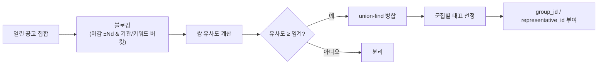

# 표시단계 Dedup 규칙 설계

> 동일 사업이 여러 소스에 중복 등장(예: 기업마당 창업분야 ↔ K-Startup, 정부지원사업 ↔ 나라장터 입찰)할 때, **저장은 분리·표시는 1건**으로 묶는다.
> 관련: [통합 스키마](db-schema-opportunities.md) · [Matching 엔진](matching-engine.md) · [BaseCollector/기업마당](collector-base-bizinfo.md)
> **작성 기준일:** 2026-06-18

---

## 1. 원칙

- **수집기는 합치지 않는다.** `(source, source_uid)`로 **원천 분리 보존**(이력·디버깅·소스별 갱신).
- **중복 판단·병합은 표시/추천 단계**에서 수행 → 사용자에겐 대표 1건 + "다른 출처" 표시.
- **보수적 병합:** 오병합(서로 다른 사업을 하나로) 위험이 누락보다 치명적 → 임계 높게, 애매하면 분리 유지.

---

## 2. 중복 군집화 알고리즘



### 2.1 블로킹 (후보쌍 축소)
전수 비교(O(n²)) 회피. 같은 버킷만 비교:
- **마감일 근접**(deadline ±3일) **AND** (동일/유사 기관 prefix **OR** 제목 토큰 공유).

### 2.2 유사도 점수 (쌍)
```
sim = 0.55 * title_sim          # 임베딩 cos 또는 trigram
    + 0.20 * agency_sim         # 기관명 정규화 일치
    + 0.15 * deadline_close     # |Δ deadline| 가까울수록 ↑
    + 0.10 * budget_close       # budget_amount 근접(있을 때)
```
- `title_sim`: 임베딩 cosine 우선(이미 벡터 보유), 보조로 `pg_trgm`.
- 임계 예: `sim ≥ 0.85` → 동일 사업으로 병합(튜닝 대상).

### 2.3 군집화
- 임계 통과 쌍을 **union-find**로 연결 → 연결요소 = 중복 군집.

### 2.4 대표(canonical) 선정
우선순위 규칙:
1. **소스 우선순위**(정보 충실도): 나라장터 > 기업마당 > K-Startup > NTIS *(R&D는 NTIS 우선 등 유형별 보정 가능)*.
2. **최신 `posted_at`** / **필드 완전성**(budget·deadline·description 채워진 것).
- 대표 = 노출 1건, 나머지는 "다른 출처(N)"로 접어서 표시.

---

## 3. 저장 모델 (사전 계산)

조회 때마다 군집화하면 비싸므로 **배치로 미리 계산** 후 컬럼에 기록.

```sql
ALTER TABLE opportunities
    ADD COLUMN dedup_group_id UUID,      -- 같은 사업 군집 식별자
    ADD COLUMN is_canonical  BOOLEAN NOT NULL DEFAULT TRUE;  -- 대표 여부
CREATE INDEX idx_opp_dedup_group ON opportunities (dedup_group_id);
CREATE INDEX idx_opp_canonical   ON opportunities (is_canonical) WHERE is_canonical;
```
- 단일 건은 자기 자신이 group(고유 `dedup_group_id`, `is_canonical=TRUE`).
- 군집은 대표 1건만 `is_canonical=TRUE`, 나머지 `FALSE` + 동일 `dedup_group_id`.

---

## 4. 실행 시점 & 연계

| 시점 | 동작 |
|---|---|
| 06:00 수집·임베딩 후 | **dedup 배치**(신규/변경분이 속한 블로킹 버킷만 재군집) |
| 07:00 매칭 | **`is_canonical=TRUE`만** 매칭/추천 대상으로 → 중복 추천 방지 |
| 08:00 브리핑 | 대표 건만 노출, "다른 출처" 메타 첨부 |

- 증분: 새 공고는 자신의 버킷만 재평가(전체 재군집 회피).

---

## 5. 의사코드

```python
@celery.task
def dedup_opportunities():
    for bucket in blocking_buckets(open_opportunities()):   # 마감±3d & 기관/토큰
        uf = UnionFind(bucket)
        for a, b in pairs(bucket):
            if similarity(a, b) >= SIM_THRESHOLD:
                uf.union(a.id, b.id)
        for cluster in uf.groups():
            group_id = stable_group_id(cluster)
            canonical = pick_canonical(cluster)            # 소스우선·완전성·최신
            for o in cluster:
                opp_repo.set_dedup(o.id, group_id=group_id,
                                   is_canonical=(o.id == canonical.id))

def similarity(a, b):
    return (0.55*title_sim(a,b) + 0.20*agency_sim(a,b)
            + 0.15*deadline_close(a,b) + 0.10*budget_close(a,b))
```

---

## 6. 엣지 케이스

| 케이스 | 처리 |
|---|---|
| 오병합 위험(유사 제목 다른 사업) | 임계 높게(0.85+), 애매하면 분리 유지(보수적) |
| 차수/연속 공고(같은 사업 재공고) | deadline 다르면 별개 취급(블로킹에서 분리) |
| 대표 변경(신규 출처가 더 완전) | 재배치 시 `is_canonical` 재산정 |
| 군집 내 일부만 마감 | canonical은 열린 건 우선 |
| 매칭이 비대표 참조 | 매칭은 `is_canonical` 필터 + group 단위 결과 노출 |
| 임계 튜닝 | 라벨 표본으로 precision 우선 평가 |

---

## 7. 평가 & 다음 단계
- [ ] 중복 라벨 표본 구축 → `SIM_THRESHOLD` 튜닝(precision 우선)
- [ ] `title_sim` 구현 선택(임베딩 cos vs pg_trgm) 벤치
- [ ] `dedup_group_id`/`is_canonical` 마이그레이션 추가
- [ ] 매칭·브리핑이 `is_canonical`만 사용하도록 연계
- [ ] "다른 출처" UI 메타(소스 목록/링크) 정의
