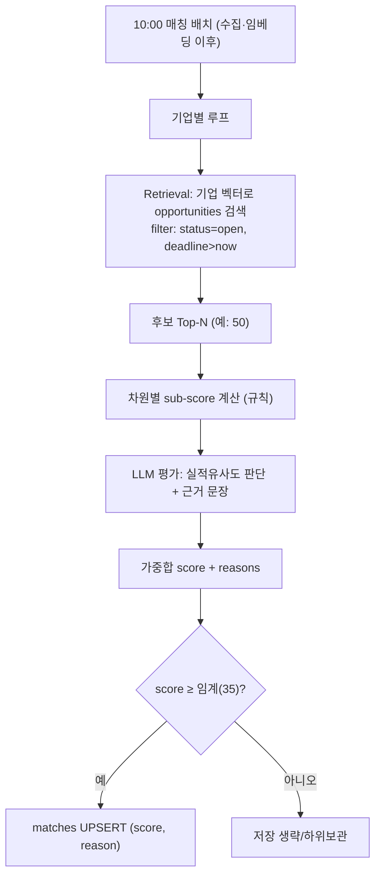

# Matching 엔진 설계

> Company Context + Opportunity → **적합도 점수(0~100) + 설명 가능한 근거**. FSD FR-008 구현.
> 관련: [FSD FR-008](../03-spec/fsd.md) · [embed 워커](embed-worker.md) · [통합 스키마](db-schema-opportunities.md) · [MVP PRD §5.3~5.4](../02-product/mvp-prd.md)
> 스택: Celery · **pgvector(Postgres)** · 최신 Claude(LLM, optional) · **작성 기준일:** 2026-06-18 (pgvector 개정 2026-06-19, 규칙 점수 캘리브레이션 §2.1 2026-06-20)

---

## 1. 목표 & 원칙

- **출력:** `score(0~100)` + `reasons[]`(구체 근거). 고객은 점수보다 **이유**를 신뢰([MVP PRD Explainable](../02-product/mvp-prd.md)).
- **입력 출처:** 기업 측 = [Company Brain](company-brain.md)의 Company Context, 공고 측 = 수집기 정규화 결과.
- **2단계:** ① **검색(Retrieval)** 로 후보 압축 → ② **스코어링(Scoring)** 으로 정밀 평가. 전수 LLM 호출은 비용·지연(NFR: 추천 ≤10초) 불가.
- **하이브리드:** 결정 가능한 차원은 **규칙**으로, 맥락 판단·근거 문장은 **LLM**으로. 점수 안정성 + 신뢰 가능한 설명.
- 🔄 **LLM optional(2026-06-20, 기본 OFF):** 키 없으면 `score_match`가 규칙 sub-score + **규칙 템플릿 근거**(기술/지역/산업/고객 일치)만 생성(track=0, risk="LLM 미사용"). `pip install .[llm]`+`ANTHROPIC_API_KEY` 시 LLM 실적유사도·근거 문장 자동 활성. → MVP는 규칙/임베딩 기반.

---

## 2. 가중치 (FSD FR-008)

| 차원 | Weight | 산출 방식 |
|---|---|---|
| 기술 일치 | 30 | 임베딩 유사도 + 기술 키워드 overlap |
| 실적 일치 | 25 | 수행실적 ↔ 공고 유사도(LLM 판단 보조) |
| 고객군 일치 | 20 | 발주/수요기관 ↔ 주요고객 매칭 |
| 산업 일치 | 15 | industry ↔ category 매핑 |
| 지역 일치 | 10 | region 정확/포함 매칭(전국=충족) |
| **합계** | **100** | 가중합 → 0~100 정규화 |

> 초기 가중치는 고정값. 퍼널 데이터(클릭/관심/참여)로 추후 튜닝([service-analysis §9](../00-overview/service-analysis.md)).

### 2.1 규칙 점수 캘리브레이션 (2026-06-20, 구현 반영 · E2E 발견 해소)

> ⚠️ **배경:** LLM OFF + 프로필 fallback context(`customers=[]`, `track_records=[]`)에서는 track·customer가 구조적으로 0이라, 초기 임계 45가 **도달 불가**(현실 상한 tech30+region10=40)였다. E2E에서 추천 0건으로 확인 → 아래로 보정.

| 차원 | 규칙 구현(LLM off 경로) | 상한 |
|---|---|---|
| 기술(tech) | `tech+keywords`에서 **STOPWORDS·1자 제외**한 변별 키워드를 opp **title+desc** 와 distinct 매칭 → `min(30, matched×12)`(1=12·2=24·3+=30). 비율식·18캡 제거 | 30 |
| 산업(industry) | 회사 industry로 `INDUSTRY_KEYWORDS` 시그널 집합 도출 → opp **title(+desc)** 에 1개↑ 등장=**15**, industry 문자열만 부분포함=8, 없음=0. (opp.category="용역" 의존 제거, "category 없으면 7" 무료점수 제거) | 15 |
| 지역(region) | opp.region 없으면 **agency 문자열에서 17개 시도 파싱**→effective_region. **ctx.regions 비었거나 '전국'이면 10(제약 없음, 무회귀 보장)** | 10 |
| 고객(customer) | ctx.customers ↔ agency 직접 + `_AGENCY_SEGMENTS`(중앙/지자체/공공기관/교육/국방/공기업) 세그먼트 파생 매칭. fallback(customers=[])=0 | 20 |
| 실적(track) | **LLM 전용** — off면 0 | 25 |

- **현실 상한(LLM off·fallback):** tech30+industry15+region10 = **~55** → **`MATCH_THRESHOLD=35`** 로 보정. 도메인 일치 공고(tech+industry+region)는 통과, 무관 공고(region만=10)는 차단.
- **검증(순수함수 단위테스트, AC1~6):** GIS×공간정보공고=37(통과)·GIS×폐기물공고=10(차단)·환경×폐기물공고=37(통과)·stopword(IT×"CRM 시스템")=25(차단, '시스템' 제외)·region 무회귀(전국+서울청)=37. 상수는 `app/services/keywords.py`로 공유(company_brain와 DRY).
- **관찰(설계 의도):** 변별 키워드만 매칭하므로 **정밀도 우선**(노이즈↓). 범용어만 가진 IT/SI 프로필은 추천이 적어질 수 있음 → 상세 프로필/문서(또는 LLM track) 보강 시 recall↑.

---

## 3. 파이프라인



### 3.1 Retrieval (후보 압축)
- 입력: `company_contexts.embedding`(해당 기업 행). 대상: `opportunities.embedding` 컬럼(pgvector).
- pgvector 검색: `embedding <=> :company_vec` 코사인 + `WHERE status='open' AND deadline>now` (행 컬럼 필터). 코드 `vectorstore.search_opportunities`.
- Top-N(예 50) 후보만 스코어링 → 검색공간·비용 축소.

### 3.2 Scoring (정밀 평가, 하이브리드)
- **규칙 sub-score:** 기술(임베딩 cos+키워드), 산업(매핑표), 지역(정확/포함), 고객군(기관명 매칭).
- **LLM sub-score+근거:** 실적 유사도(과거 수행실적 ↔ 공고)와 **설명 문장**. 한 번의 호출로 후보 묶음 처리(배치 프롬프트)해 비용↓.
- 가중합 → 0~100. `reasons`는 근거 있는 항목만(예: "LX 디지털트윈 수행실적 유사", "발주기관 경험 보유").

---

## 4. LLM 스코어링 인터페이스

```jsonc
// 입력(요약): company_context + 후보 opportunity
// 출력 스키마(구조화 강제)
{
  "opportunity_id": "...",
  "subscores": { "tech": 0-30, "track": 0-25, "customer": 0-20,
                 "industry": 0-15, "region": 0-10 },
  "score": 0-100,
  "reasons": ["유사 수행실적: ...", "기술요건 일치: ...", "발주기관 경험: ..."],
  "risk": "필수자격 미충족 가능 등(있으면)"
}
```
- 규칙으로 산출 가능한 subscore(지역·산업)는 **프롬프트에 사전 계산값 주입** → LLM은 실적/맥락만 판단(환각·편차↓).
- 모델: 최신 Claude(Opus 4.8). 근거 문장 품질 우선.

---

## 5. 저장 & 멱등

- 결과 → `matches(company_id, opportunity_id, score, reason)` **UPSERT**(스키마 §9 UNIQUE(company_id, opportunity_id)).
- **재계산 트리거:** opportunity `content_hash` 변경 또는 company context 변경 시 해당 조합 재매칭.
- **임계:** `score ≥ THRESHOLD`(**현재 35**, §2.1 캘리브레이션)만 저장/알림 대상. 하위는 생략하거나 별도 보관(노출 안 함). LLM 활성 시 track·customer가 살아나므로 상향 재검토.
- reason은 `matches.reason`(텍스트/JSON), subscore는 필요 시 JSONB 컬럼 확장.

---

## 6. 스케줄 & 대상 산정

| 시각(KST) | 작업 |
|---|---|
| 08:50 | status sweep |
| 09:00 | 수집(나라장터) + 임베딩 |
| 09:05 | 낙찰 수집(run_scsbid) |
| 09:30 | dedup |
| **10:00** | **매칭** — 신규/변경 공고 × 활성 기업 |
| 11:00 | 카카오 브리핑(Top 3, [briefing]) |

- 대상 최소화: "오늘 신규/변경 임베딩된 공고" × "활성(구독) 기업"만 재매칭. 전수 재계산 회피.
- 신규 가입/프로필 변경 기업은 전체 열린 공고 대상 1회 풀매칭.

---

## 7. 성능 & 비용

- Retrieval Top-N + 임계로 LLM 호출 건수 제한. 후보 배치 프롬프트로 호출 횟수↓.
- 캐시: 동일 `(company_hash, opportunity_hash)` 조합 결과 캐시 → 변경 없으면 재호출 0.
- NFR: 추천 생성 ≤10초(기업당) 목표 → N·배치 크기 튜닝.

---

## 8. 엣지 케이스

| 케이스 | 처리 |
|---|---|
| 기업 컨텍스트 미생성 | 매칭 스킵(온보딩 유도) |
| 후보 0건(필터 과함) | 임계/필터 완화 또는 "오늘 추천 없음" |
| LLM 출력 스키마 위반 | 재시도/검증, 실패 시 규칙 score만 사용 |
| 중복 공고(다source) | [표시 dedup](display-dedup.md)으로 추천 단계 1건화 |
| 필수자격 미충족 | `risk` 표기, 점수 감점 또는 경고 노출 |
| 마감 임박/지난 | status·deadline 필터로 제외 |

---

## 9. 테스트 & 다음 단계
- [x] 차원별 sub-score 규칙 단위 테스트(지역/산업/기술 키워드) — `tests/unit/test_matching_score.py`(AC1~6 포함)
- [ ] LLM 스코어링 출력 스키마 검증·재시도
- [x] 임계(THRESHOLD) 초기 보정 35(§2.1) — Top-N 튜닝·퍼널 기반 재조정은 후속
- [ ] `matches` subscore/risk 저장 컬럼(JSONB) 확장 여부 결정
- [ ] 표시 dedup 연계([display-dedup.md](display-dedup.md))
- [ ] 카카오 Daily Briefing(Top 3) 연계 → [daily-briefing.md](daily-briefing.md)
